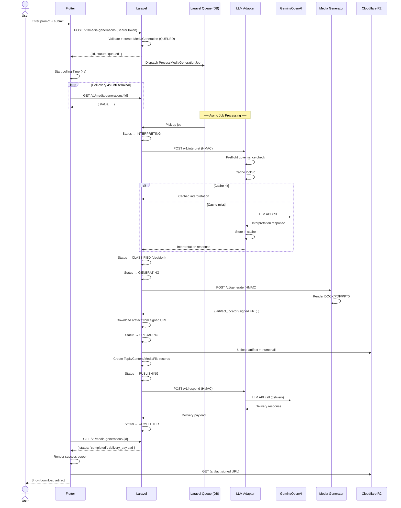
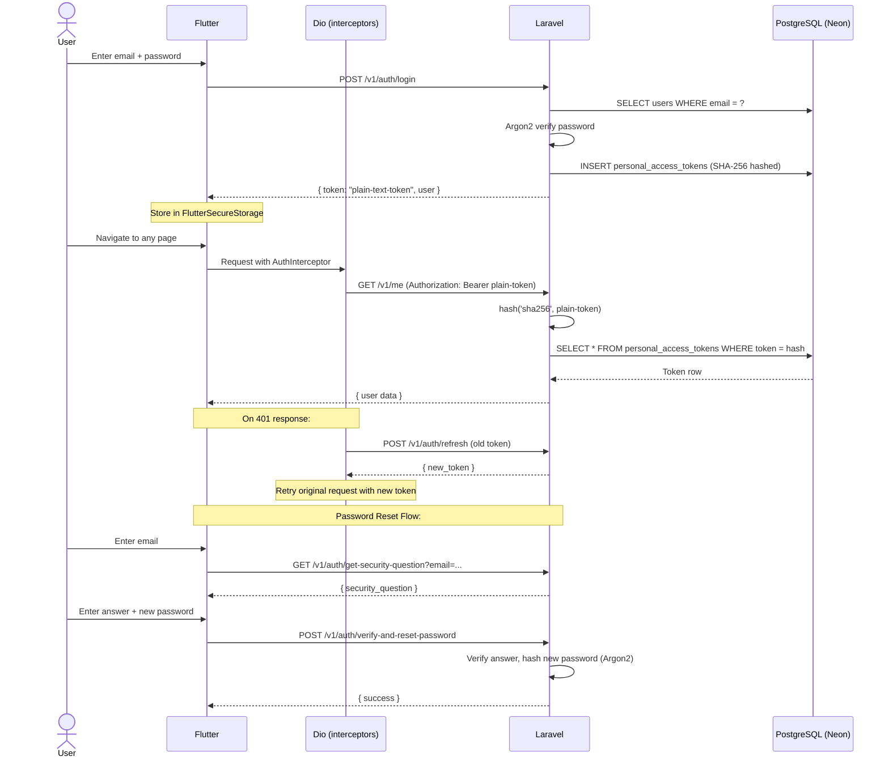
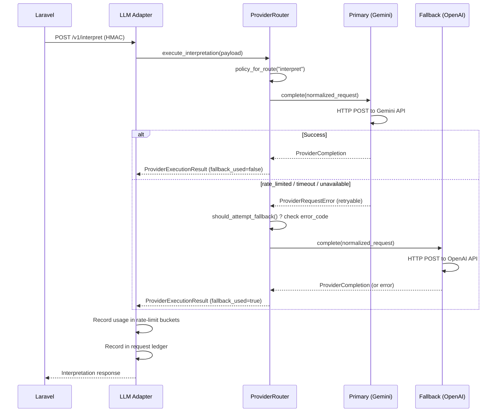
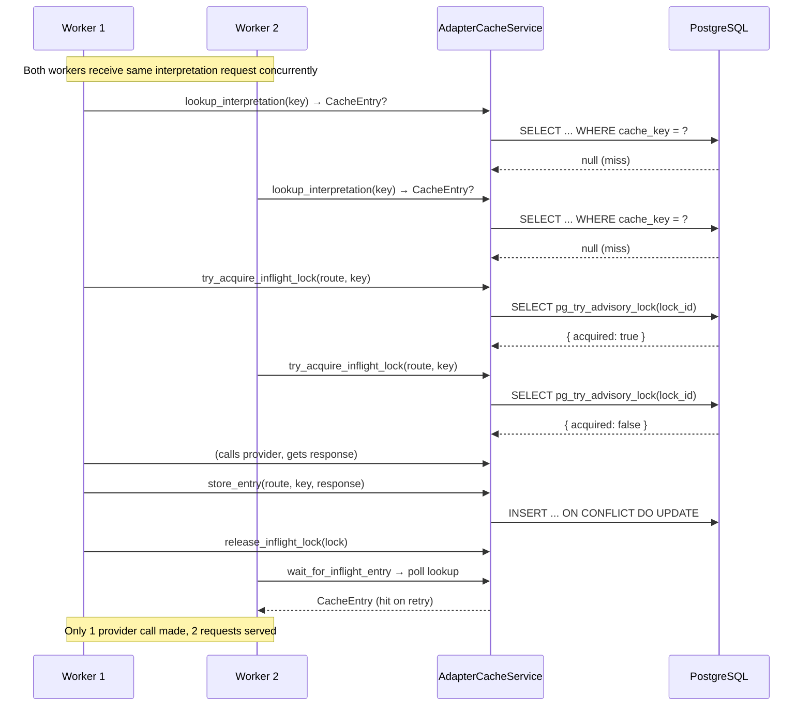

# Integration Mapping: Service Boundaries & Contracts

> **Phase**: Fase 1 Audit (Task 1.4)
> **Generated**: 2026-07-11
> **Source**: Code audit of `backend/`, `llm-adapter-service/`, `media-generator-service/`

---

## Table of Contents

1. [Architecture Overview](#architecture-overview)
2. [Sequence Diagrams](#sequence-diagrams)
3. [HMAC Inter-Service Auth Contract](#hmac-inter-service-auth-contract)
4. [LLM Adapter Provider Behavior](#llm-adapter-provider-behavior)
5. [Rate-Limit & Governance](#rate-limit--governance)
6. [Error Code Index](#error-code-index)
7. [Timeout & Retry Matrix](#timeout--retry-matrix)
8. [Circuit Breaker Gap Analysis](#circuit-breaker-gap-analysis)
9. [Cache Architecture](#cache-architecture)
10. [Media Generator Contract](#media-generator-contract)

---

## Architecture Overview

```
┌──────────┐   REST/JSON      ┌──────────┐   HMAC-SHA256    ┌───────────────┐   API Key    ┌──────────┐
│  Flutter  │ ───────────────>│  Laravel  │ ───────────────>│  LLM Adapter   │ ───────────>│  Gemini  │
│  (Dio)    │ <──polling───── │  (PHP)    │ <───────────────│  (Python)      │ <───────────│ / OpenAI │
└──────────┘                  └────┬─────┘                  └───────┬───────┘              └──────────┘
                                   │                                │
                                   │ HMAC-SHA256                    │ PostgreSQL
                                   │                                │ (LLM Adapter DB)
                                   v                                v
                            ┌──────────────┐              ┌─────────────────┐
                            │ Media Gen     │              │  cache entries  │
                            │ (Python)      │              │  rate-limit     │
                            │ DOCX/PDF/PPTX │              │  governance     │
                            └──────┬───────┘              └─────────────────┘
                                   │
                                   │ signed URL
                                   v
                            ┌──────────┐
                            │ R2 / S3  │
                            │ (storage)│
                            └──────────┘
```

### Service Inventory

| # | Service | Language | Hosting | Port/Protocol |
|---|---------|----------|---------|--------------|
| 1 | Flutter App | Dart | Mobile device | REST (Dio) + gRPC (future) |
| 2 | Laravel Backend | PHP 8.3 | HF Space #1 | REST (port 8000) |
| 3 | LLM Adapter | Python/FastAPI | HF Space #2 | REST (HMAC-secured) |
| 4 | Media Generator | Python/FastAPI | HF Space #3 | REST (HMAC-secured) |
| 5 | Neon PostgreSQL | — | Neon Cloud | SQL (PgBouncer) |
| 6 | Cloudflare R2 | — | Cloudflare | S3-compatible API |

---

## Sequence Diagrams

### 1. Primary Flow: Media Generation (Submit → Completed)



### 2. Auth Flow: Flutter → Laravel



### 3. Provider Fallback Flow



### 4. Cache Stampede Protection Flow



---

## HMAC Inter-Service Auth Contract

### Overview

All internal service-to-service communication (Laravel → LLM Adapter, Laravel → Media Generator) is secured by HMAC-SHA256 request signing.

### Algorithm

| Property | Value |
|----------|-------|
| Algorithm | `HMAC-SHA256` |
| Signature input | `{unix_timestamp}.{raw_request_body}` |
| Signature output | Hex-encoded HMAC digest |
| Timestamp format | Unix epoch seconds (string) |
| Replay protection | `request_max_age_seconds` (default: 300s) |
| Secret rotation | Supported via `accepted_shared_secrets` list |

### Request Headers

| Header | Required | Description | Example |
|--------|----------|-------------|---------|
| `Content-Type` | Yes | Always `application/json` | `application/json` |
| `X-Request-Id` | No | UUID for tracing | `550e8400-e29b-...` |
| `X-Klass-Generation-Id` | Yes | Media generation UUID | `550e8400-e29b-...` |
| `X-Klass-Request-Timestamp` | Yes | Unix epoch seconds | `1752230400` |
| `X-Klass-Signature-Algorithm` | Yes | Always `hmac-sha256` | `hmac-sha256` |
| `X-Klass-Signature` | Yes | Hex HMAC digest | `a1b2c3...` |

### PHP Implementation Reference

```php
// Source: backend/app/Services/InterServiceRequestSigner.php (line 23-45)

$timestamp = (string) now()->timestamp;
$signature = hash_hmac('sha256', $timestamp . '.' . $encodedPayload, $sharedSecret);

// Generated headers:
// X-Request-Id: {uuid}
// X-Klass-Generation-Id: {generation_id}
// X-Klass-Request-Timestamp: {unix_timestamp}
// X-Klass-Signature-Algorithm: hmac-sha256
// X-Klass-Signature: {hex_signature}
```

### Python Verification (LLM Adapter)

```python
# Source: llm-adapter-service/app/auth.py (line 60-138)

# 1. Validate shared_secret is configured
# 2. Validate generation_id header present
# 3. Validate signature_algorithm == "hmac-sha256"
# 4. Validate timestamp is valid integer
# 5. Validate |current_time - issued_at| <= request_max_age_seconds (default: 300)
# 6. Compute: hmac.new(secret, timestamp + "." + body, sha256).hexdigest()
# 7. Compare against accepted_shared_secrets list (supports rotation)

expected_signatures = [
    hmac.new(secret.encode("utf-8"),
             timestamp.encode("utf-8") + b"." + body,
             hashlib.sha256).hexdigest()
    for secret in settings.accepted_shared_secrets
]
# Use secrets.compare_digest() for timing-safe comparison
```

### Python Verification (Media Generator)

```python
# Source: media-generator-service/app/auth.py (line 15-74)

# Same algorithm, simpler implementation (no secret rotation)
# - reads shared_secret directly
# - validates: generation_id, signature_algorithm, timestamp freshness
# - compares: HMAC-SHA256(timestamp + "." + body, shared_secret)
```

### Rust Implementation Notes (for migration)

```
// Pseudocode for Rust re-implementation:
// 1. Use `hmac` + `sha2` crates
// 2. Signature: hex::encode(HmacSha256::new(secret).chain(timestamp).chain(".").chain(body).finalize())
// 3. Timing-safe compare: constant_time_eq crate OR subtle crate
// 4. Secret rotation: iterate accepted_secrets list
// 5. Replay: verify |now - timestamp| <= config.request_max_age_seconds
```

### Env Variables

| Variable | Service | Default |
|----------|---------|---------|
| `MEDIA_GENERATION_LLM_ADAPTER_SHARED_SECRET` | Laravel | — |
| `LLM_ADAPTER_SHARED_SECRET` | LLM Adapter | — |
| `LLM_ADAPTER_SHARED_SECRET_PREVIOUS` | LLM Adapter | — (rotation) |
| `LLM_ADAPTER_REQUEST_MAX_AGE_SECONDS` | LLM Adapter | `300` |
| `MEDIA_GENERATION_PYTHON_SHARED_SECRET` | Both | — |
| `MEDIA_GENERATION_LLM_ADAPTER_REQUEST_MAX_AGE_SECONDS` | Laravel | `300` |
| `MEDIA_GENERATION_LLM_ADAPTER_CLOCK_SKEW_SECONDS` | Laravel | `30` |

---

## LLM Adapter Provider Behavior

### Provider Routes

The LLM Adapter exposes 3 endpoints, mapped to 2 internal routes:

| Endpoint | Internal Route | Request Type |
|----------|---------------|--------------|
| `POST /v1/interpret` | `interpret` | `media_prompt_interpretation` |
| `POST /v1/draft` | `respond` | `media_content_draft` |
| `POST /v1/respond` | `respond` | `media_delivery_response` |

### Supported Providers

| Provider | Status | Required Env |
|----------|--------|-------------|
| `gemini` | Implemented | `LLM_ADAPTER_GEMINI_API_KEY` |
| `openai` | Implemented | `LLM_ADAPTER_OPENAI_API_KEY` |

### Gemini Provider

- **Source**: `llm-adapter-service/app/providers/gemini.py` (339 lines)
- **Class**: `GeminiProviderClient`
- **Endpoint**: `https://generativelanguage.googleapis.com/v1beta/models/{model}:generateContent`
- **Auth**: API key as query parameter (`?key=...`)
- **Default models**:
  - Interpretation: `gemini-2.0-flash`
  - Delivery: `gemini-2.0-flash`
- **Request format**:
  ```json
  {
    "systemInstruction": { "parts": [{"text": "<instruction>"}] },
    "contents": [{ "role": "user", "parts": [{"text": "<payload>"}] }],
    "generationConfig": { 
      "candidateCount": 1,
      "responseMimeType": "application/json"
    }
  }
  ```
- **Response parsing**: `candidates[] → content.parts[] → .text` (concatenated)
- **Usage extraction**: `usageMetadata.promptTokenCount`, `candidatesTokenCount`, `totalTokenCount`
- **Request ID header**: `x-request-id` or `x-goog-request-id`
- **Instruction guardrails**: Interpretation requests are augmented with JSON structure guardrails (see `INTERPRETATION_INSTRUCTION_GUARDRAILS` in `base.py:15-28`)

### OpenAI Provider

- **Source**: `llm-adapter-service/app/providers/openai.py` (401 lines)
- **Class**: `OpenAIProviderClient`
- **Endpoint**: `https://api.openai.com/v1/responses`
- **Auth**: Bearer token (`Authorization: Bearer {key}`)
- **Optional headers**: `OpenAI-Organization`, `OpenAI-Project`
- **Default models**:
  - Interpretation: `gpt-5.4`
  - Delivery: `gpt-5.4`
- **Request format**:
  ```json
  {
    "model": "gpt-5.4",
    "input": [
      { "role": "system", "content": [{"type": "input_text", "text": "<instruction>"}] },
      { "role": "user", "content": [{"type": "input_text", "text": "<payload>"}] }
    ],
    "text": { "format": { "type": "json_object" } }
  }
  ```
- **Response parsing**: Priority order:
  1. Top-level `output_text`
  2. `output[].content[].text` (where `type` is `output_text` or `text`)
  3. `choices[].message.content` (legacy fallback)
  4. `choices[].text` (legacy fallback)
- **Usage extraction**: `usage.input_tokens` (or `prompt_tokens`), `output_tokens` (or `completion_tokens`), `total_tokens`
- **Finish reason**: `status`, `incomplete_details.reason`, or `finish_reason`
- **Request ID**: `x-request-id` header or response `id`

### Provider Router

- **Source**: `llm-adapter-service/app/providers/routing.py` (238 lines)
- **Class**: `ProviderRouter`
- **Key behaviors**:
  - Each route (interpret/respond) has independent primary + fallback provider config
  - Route divergence can be allowed or disallowed (`allow_route_provider_divergence`)
  - Primary call → on `ProviderRequestError` → check `fallback_error_codes` → attempt fallback
  - Fallback is attempted only if error code is in `provider_fallback_error_codes`
  - If fallback fails too, the primary error is raised (with augmented metadata)

### Fallback Error Codes

```python
# Source: llm-adapter-service/app/contracts.py (line 26-31)
DEFAULT_PROVIDER_FALLBACK_ERROR_CODES = (
    "provider_timeout",           # HTTP 504, retryable
    "provider_connection_failed", # HTTP 503, retryable
    "provider_rate_limited",      # HTTP 429, retryable
    "provider_unavailable",       # HTTP 503, retryable
)
```

### Model Resolution Logic

| Requested model starts with... | Route | Resolved model |
|-------------------------------|-------|---------------|
| `gemini` | any | As-is (passthrough) |
| `gpt` / `o` / `chatgpt` | any | As-is (passthrough) |
| other / empty | `interpret` | `LLM_ADAPTER_GEMINI_INTERPRET_MODEL` (default: `gemini-2.0-flash`) |
| other / empty | `respond` | `LLM_ADAPTER_GEMINI_DELIVERY_MODEL` (default: `gemini-2.0-flash`) |

---

## Rate-Limit & Governance

### Governance Architecture

```
Request In
    │
    ▼
┌─────────────────────┐
│  preflight_check()  │ ◄── AdapterGovernanceService
│                     │
│  1. Check route     │
│     enabled?        │──── No ──► "delivery_route_disabled"
│                     │
│  2. Fetch applicable│
│     rate-limit      │
│     policies (DB)   │
│                     │
│  3. For each policy │
│     check bucket    │
│     ceilings        │
│                     │
│  All pass? ── Yes ──► GovernanceDecision(allowed=true)
│                     │
│  Blocked?           │
│    │                │
│    ├─ deny action ──► HTTP 429 (reject)
│    └─ degrade ──────► HTTP 503 (fallback allowed)
└─────────────────────┘
```

### Default Policies (pre-seeded at startup)

| Scope | Window | Route | Ceiling |
|-------|--------|-------|---------|
| route | minute | interpret | 30 requests |
| route | hour | interpret | 600 requests |
| route | day | interpret | $25.00 USD |
| route | minute | respond | 60 requests |
| route | hour | respond | 1200 requests |
| route | day | respond | $10.00 USD |

### Exhausted Actions

| Route | Default Action | Meaning |
|-------|---------------|---------|
| `interpret` | `deny` | Reject request with 429 |
| `respond` | `degrade` | Block but signal "fallback allowed" (Laravel handles gracefully) |

### Policy Scopes (in evaluation order)

1. **route** — specific to a route (interpret/respond)
2. **provider** — per provider (gemini/openai)
3. **model** — per model (gemini-2.0-flash, etc.)
4. **global** — applies to all

### Budget Statuses

| Status | Condition |
|--------|-----------|
| `healthy` | utilization < warning_ratio (0.80) |
| `warning` | utilization >= 0.80 OR next request exhausts budget |
| `exhausted` | spent >= daily_budget OR budget = 0 |
| `disabled` | route enabled = false |
| `unavailable` | Postgres not reachable |

### Cache TTL Configuration

| Route | TTL (default) | Env Variable |
|-------|--------------|-------------|
| `interpret` | 86400s (24h) | `LLM_ADAPTER_INTERPRETATION_CACHE_TTL_SECONDS` |
| `respond` | 21600s (6h) | `LLM_ADAPTER_DELIVERY_CACHE_TTL_SECONDS` |

---

## Error Code Index

### Provider-Level Errors (LLM Adapter → Laravel)

| Code | HTTP | Retryable | Source | Notes |
|------|------|-----------|--------|-------|
| `provider_timeout` | 504 | Yes | Gemini/OpenAI | Triggers provider fallback |
| `provider_connection_failed` | 503 | Yes | Gemini/OpenAI | DNS/TCP failure |
| `provider_rate_limited` | 429 | Yes | Gemini/OpenAI | Upstream provider rate limit |
| `provider_unavailable` | 503 | Yes | Gemini/OpenAI | Upstream 5xx |
| `provider_auth_failed` | 503 | No | Gemini/OpenAI | Bad API key (401/403) |
| `provider_request_invalid` | 502 | No | Gemini/OpenAI | Bad request payload (400) |
| `provider_upstream_failed` | 502 | No | Gemini/OpenAI | Unexpected error |
| `provider_response_invalid` | 502 | Yes | Gemini/OpenAI | Non-JSON or missing text |

### Governance Errors (LLM Adapter internal)

| Code | HTTP | Retryable | Source |
|------|------|-----------|--------|
| `route_rate_limited` | 429 | No | `governance.py` |
| `route_budget_exhausted` | 429 | No | `governance.py` |
| `delivery_route_disabled` | 503 | No | `governance.py` |
| `provider_route_divergence_disallowed` | 503 | No | `routing.py` |
| `provider_fallback_missing` | 503 | No | `routing.py` |
| `provider_route_unsupported` | 500 | No | `routing.py` |
| `provider_route_payload_invalid` | 500 | No | `routing.py` |
| `governance_unavailable` | — | No | `governance.py` (health only) |

### HMAC Auth Errors

| Code | HTTP | Source | Condition |
|------|------|--------|-----------|
| `shared_secret_missing` | 503 | LLM Adapter | Secret not configured |
| `generation_id_header_missing` | 401 | Both | Missing header |
| `signature_algorithm_invalid` | 401 | Both | Not `hmac-sha256` |
| `timestamp_invalid` | 401 | Both | Can't parse as int |
| `timestamp_out_of_range` | 401 | Both | Beyond `request_max_age_seconds` |
| `signature_invalid` | 401 | Both | HMAC mismatch |

### Media Generator Errors

| Code | HTTP | Laravel Error Hint | Source |
|------|------|-------------------|--------|
| `signature_invalid` | 401 | `python_service_unavailable` | `auth.py` |
| `timestamp_invalid` | 401 | `python_service_unavailable` | `auth.py` |
| `timestamp_out_of_range` | 401 | `python_service_unavailable` | `auth.py` |
| `generation_id_header_missing` | 401 | `python_service_unavailable` | `auth.py` |
| `signature_algorithm_invalid` | 401 | `python_service_unavailable` | `auth.py` |
| `unsupported_export_format` | 422 | `artifact_invalid` | `errors.py` |
| `service_misconfigured` | 503 | `python_service_unavailable` | `errors.py` |
| `artifact_invalid` | — | `artifact_invalid` | Laravel | Invalid artifact from Python |
| `python_service_unavailable` | — | `python_service_unavailable` | Laravel | Comm failure |

### Flutter Error Mapping

```dart
// Source: frontend/lib/core/network/api_error.dart
// Laravel error format: { success: false, error: { code, message } }
// Flutter maps server codes to user-facing messages
```

---

## Timeout & Retry Matrix

### Laravel → LLM Adapter

| Route | Endpoint | Timeout | Connect Timeout | Retries | Backoff |
|-------|----------|---------|-----------------|---------|---------|
| Interpreter | `/v1/interpret` | 30s | 10s | 2 | 250ms |
| Drafting | `/v1/draft` | 30s | 10s | 2 | 250ms |
| Delivery | `/v1/respond` | 30s | 10s | 2 | 250ms |
| LLM Adapter (shared) | `/v1/health` | — | — | — | — |

### Laravel → Media Generator

| Route | Endpoint | Timeout | Connect Timeout | Retries | Backoff |
|-------|----------|---------|-----------------|---------|---------|
| Generate | `/v1/generate` | 60s | 10s | 2 | 500ms |
| Health | `/v1/health` | — | — | — | — |

### LLM Adapter → Upstream LLM Provider

| Setting | Default | Env Variable |
|---------|---------|-------------|
| Upstream timeout | 30s | `LLM_ADAPTER_UPSTREAM_TIMEOUT_SECONDS` |

### Queue Configuration

| Setting | Default | Env Variable |
|---------|---------|-------------|
| Max attempts | 3 | `MEDIA_GENERATION_QUEUE_TRIES` |
| Job timeout | 300s | `MEDIA_GENERATION_QUEUE_TIMEOUT_SECONDS` |
| Backoff | 30s | `MEDIA_GENERATION_QUEUE_BACKOFF_SECONDS` |
| Sleep | 3s | `MEDIA_GENERATION_QUEUE_SLEEP_SECONDS` |
| Max jobs | 250 | `MEDIA_GENERATION_QUEUE_MAX_JOBS` |
| Max time | 3600s | `MEDIA_GENERATION_QUEUE_MAX_TIME_SECONDS` |
| Memory limit | 256MB | `MEDIA_GENERATION_QUEUE_MEMORY_MB` |
| Concurrency | 1 | `MEDIA_GENERATION_QUEUE_CONCURRENCY` |

### Flutter → Laravel

| Setting | Value |
|---------|-------|
| Connect timeout | 30s |
| Receive timeout | 30s |
| Send timeout | 30s |
| Retry attempts | 2 |
| Retry base delay | 500ms |
| Polling interval (media-gen) | 4s |

### Total Time Budget (worst case)

```
Interpreter: 30s × 3 attempts = 90s
Drafting:    30s × 3 attempts = 90s
Generate:    60s × 3 attempts = 180s
Delivery:    30s × 3 attempts = 90s
───────────────────────────────
Total worst case:             450s (7.5 min)
Queue timeout:                300s  ⚠️ Gap!
```

> **Note**: Queue timeout (300s) is less than the sum of all worst-case retries (450s). In practice, this means retries are bounded by the queue timeout. If the job exceeds 300s, Laravel kills it and the queue handler retries the entire job (up to 3 times).

---

## Circuit Breaker Gap Analysis

### Current State

**No circuit breaker exists** in any service. All retry logic is simple linear-backoff retry with fixed attempt counts:

```
┌─────────┐     ┌─────────┐     ┌─────────┐
│ Attempt │────►│ Attempt │────►│ Attempt │────► Give up
│    1    │250ms│    2    │250ms│    3    │
└─────────┘     └─────────┘     └─────────┘
```

### Risks Without Circuit Breaker

1. **Cascading failure**: If Gemini is degraded, all 3 retries still hit it before fallback
2. **Resource waste**: Failed attempts consume connection pool and CPU
3. **No fast-fail**: Slower recovery when upstream is definitively down
4. **Thundering herd**: All concurrent jobs hit the same failing service

### Rust Migration Target

The plan specifies using `tower` middleware stack for Rust:

```rust
// Planned architecture (from IMPLEMENTATION_PLAN.md):
// - tower::limit::ConcurrencyLimit
// - tower::retry::Policy
// - tower::timeout
// 
// Goal: 5 consecutive failures → circuit open for 30s → fast-fail
```

---

## Cache Architecture

### Cache Schema

Two separate tables (to be consolidated in Rust):

| Table | Route | TTL |
|-------|-------|-----|
| `interpretation_cache_entries` | `interpret` | 24h |
| `delivery_cache_entries` | `respond` | 6h |

### Cache Key Generation

```python
# Source: llm-adapter-service/app/cache.py (line 686-694)

# 1. Build cache document (deterministic JSON):
#    { schema_version, route, request_type, provider, model, instruction, input }
# 2. Null values removed via _normalize_value
# 3. Serialize: json.dumps(doc, ensure_ascii=False, sort_keys=True, separators=(",", ":"))
# 4. Hash: sha256(serialized.encode("utf-8")).hexdigest()
```

### Advisory Lock (Stampede Protection)

```python
# Source: llm-adapter-service/app/cache.py (line 229-237)

# Lock ID = blake2b(route + ":" + cache_key, digest_size=8, person=b"klasscch")
#   → int.from_bytes(digest, "big")
#   → if >= 2^63: subtract 2^64 (signed i64)
#   → if 0: use 1

# Used with PostgreSQL advisory locks:
# pg_try_advisory_lock(lock_id)  -- acquire
# pg_advisory_unlock(lock_id)    -- release
```

### Rust Implementation Note

The lock ID must be **byte-identical** to the Python implementation for cache migration compatibility. The `person` parameter in Blake2b is critical — must use exactly `b"klasscch"`.

### Lazy Cleanup

- Triggered on every cache lookup
- Interval: 60s between cleanup runs (configurable)
- Batch size: 100 expired entries per run (configurable)
- Deletes entries where `expires_at <= NOW()`

---

## Media Generator Contract

### Request (Laravel → Media Gen)

```
POST /v1/generate
Headers:
  Content-Type: application/json
  X-Klass-Generation-Id: {uuid}
  X-Klass-Request-Timestamp: {unix_timestamp}
  X-Klass-Signature-Algorithm: hmac-sha256
  X-Klass-Signature: {hex_hmac}

Body: (matches MediaGenerationSpec schema)
  {
    "generation_spec_version": "media_generation_spec.v1",
    "preferred_output_type": "pdf" | "docx" | "pptx" | "auto",
    "prompt_interpretation": { ... },
    "document_blueprint": { ... },
    "media_characteristics": { ... }
  }
```

### Response (Media Gen → Laravel)

```json
{
  "artifact_metadata": {
    "metadata_version": "media_generator_output_metadata.v1",
    "export_format": "pdf",
    "mime_type": "application/pdf",
    "size_bytes": 123456,
    "checksum_sha256": "..."
  },
  "artifact_locator": "https://{huggingface-space}/artifacts/{id}?token=..."
}
```

### Supported Export Formats

| Format | MIME Type | Status |
|--------|-----------|--------|
| `docx` | `application/vnd.openxmlformats-officedocument.wordprocessingml.document` | Implemented |
| `pdf` | `application/pdf` | Implemented |
| `pptx` | `application/vnd.openxmlformats-officedocument.presentationml.presentation` | Implemented |

### Error Response Format

```json
{
  "detail": {
    "code": "unsupported_export_format",
    "message": "Export format 'xlsx' is not implemented by this service.",
    "details": { "export_format": "xlsx", "supported_formats": ["docx", "pdf", "pptx"] },
    "retryable": true
  }
}
```

---

## Environment Variable Inventory

### Shared Secrets (Inter-Service Auth)

| Variable | Consumers | Secret Type |
|----------|-----------|-------------|
| `MEDIA_GENERATION_LLM_ADAPTER_SHARED_SECRET` | Laravel | Primary (LLM Adapter) |
| `LLM_ADAPTER_SHARED_SECRET` | LLM Adapter | Primary verification |
| `LLM_ADAPTER_SHARED_SECRET_PREVIOUS` | LLM Adapter | Rotation (prev) |
| `MEDIA_GENERATION_PYTHON_SHARED_SECRET` | Laravel + Media Gen | Primary (Media Gen) |

### Service Endpoints

| Variable | Service | Default |
|----------|---------|---------|
| `MEDIA_GENERATION_LLM_ADAPTER_BASE_URL` | Laravel | — |
| `MEDIA_GENERATION_INTERPRETER_PATH` | Laravel | `/v1/interpret` |
| `MEDIA_GENERATION_DRAFTING_PATH` | Laravel | `/v1/draft` |
| `MEDIA_GENERATION_DELIVERY_PATH` | Laravel | `/v1/respond` |
| `MEDIA_GENERATION_PYTHON_BASE_URL` | Laravel | — |
| `MEDIA_GENERATION_PYTHON_GENERATE_PATH` | Laravel | `/v1/generate` |
| `LLM_ADAPTER_GEMINI_BASE_URL` | LLM Adapter | `https://generativelanguage.googleapis.com` |
| `LLM_ADAPTER_GEMINI_API_VERSION` | LLM Adapter | `v1beta` |
| `LLM_ADAPTER_OPENAI_BASE_URL` | LLM Adapter | `https://api.openai.com` |

### Provider API Keys

| Variable | Service | Provider |
|----------|---------|----------|
| `LLM_ADAPTER_GEMINI_API_KEY` | LLM Adapter | Gemini |
| `LLM_ADAPTER_OPENAI_API_KEY` | LLM Adapter | OpenAI |
| `LLM_ADAPTER_OPENAI_ORGANIZATION` | LLM Adapter | OpenAI (optional) |
| `LLM_ADAPTER_OPENAI_PROJECT` | LLM Adapter | OpenAI (optional) |

---

## State Machine Integration Points

The `MediaGenerationLifecycle` state machine (9 states) transitions based on integration call outcomes:

```
QUEUED ──(job picks up)──► INTERPRETING ──(adapter success)──► CLASSIFIED
                                                               │
                                       ┌───────────────────────┘
                                       ▼
                                  GENERATING ──(media gen success)──► UPLOADING
                                                                       │
                                                                       ▼
                                                                  PUBLISHING ──(all entities created)──► COMPLETED

Any state ──(fatal error)──► FAILED
Any state ──(user cancel)──► CANCELLED
```

**Integration dependencies per state**:
- `INTERPRETING`: Requires LLM Adapter `POST /v1/interpret` success
- `CLASSIFIED`: Local-only (no external call)
- `GENERATING`: Requires Media Generator `POST /v1/generate` success
- `UPLOADING`: Requires R2/S3 upload success
- `PUBLISHING`: Requires LLM Adapter `POST /v1/respond` success
- `COMPLETED`: Terminal state, all integrations complete
