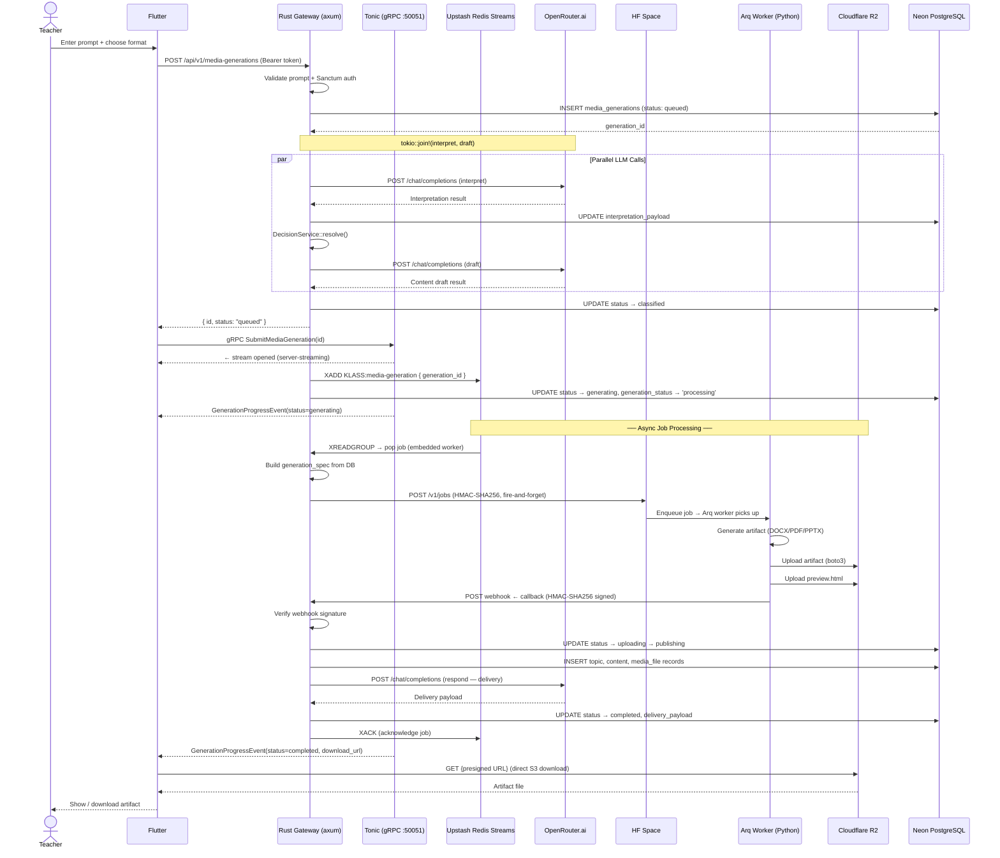
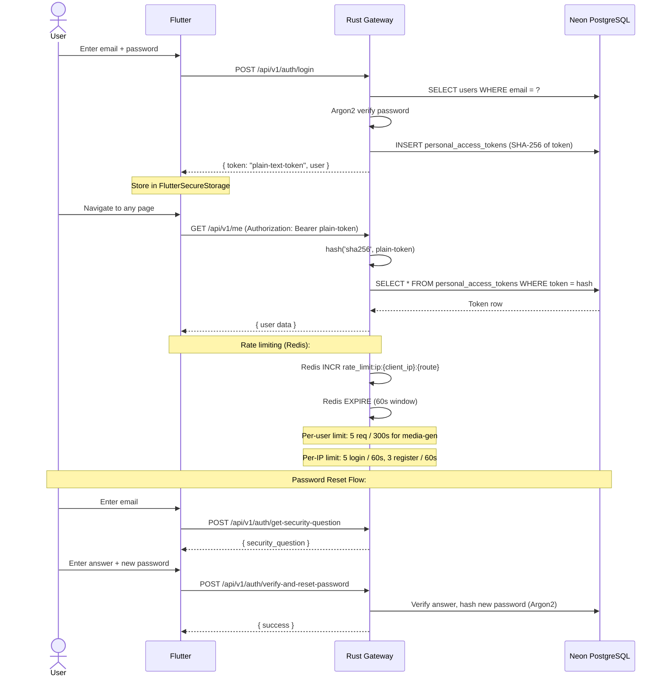
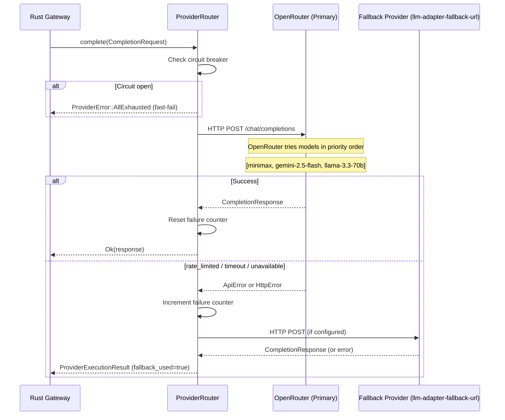
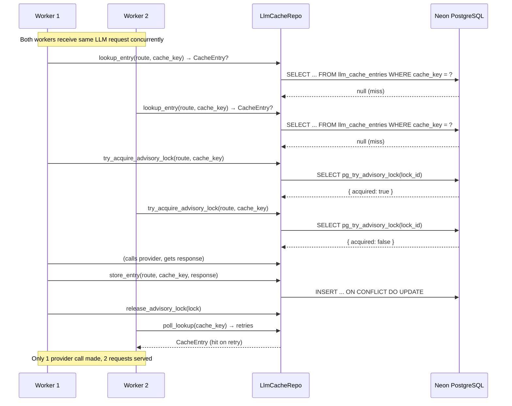
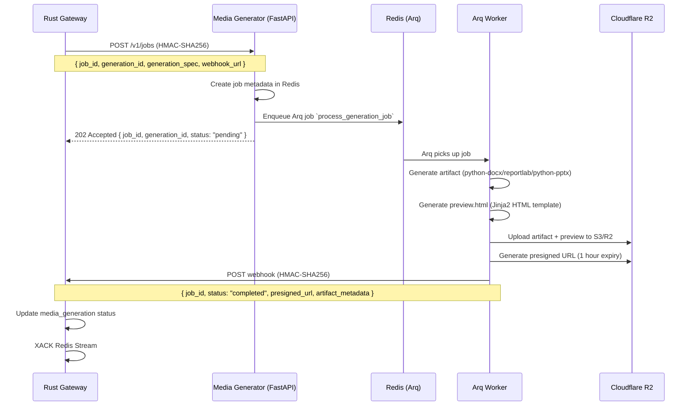

# Integration Mapping: Service Boundaries & Contracts

> **Phase**: Fase 2 — Rust Gateway (Post-Consolidation)
> **Generated**: 2026-07-29
> **Source**: Code audit of `gateway/`, `frontend/`, `media-generator-service/`, `docs/`

---

## Table of Contents

1. [Architecture Overview](#architecture-overview)
2. [Sequence Diagrams](#sequence-diagrams)
3. [HMAC Inter-Service Auth Contract](#hmac-inter-service-auth-contract)
4. [LLM Provider Behavior](#llm-provider-behavior)
5. [Rate-Limit & Governance](#rate-limit--governance)
6. [Error Code Index](#error-code-index)
7. [Timeout & Retry Matrix](#timeout--retry-matrix)
8. [Circuit Breaker Implementation](#circuit-breaker-implementation)
9. [Cache Architecture](#cache-architecture)
10. [Media Generator Contract (Async)](#media-generator-contract-async)
11. [Freelancer Matching Engine](#freelancer-matching-engine)
12. [Recommendation Engine](#recommendation-engine)
13. [Environment Variable Inventory](#environment-variable-inventory)
14. [State Machine Integration Points](#state-machine-integration-points)

---

## Architecture Overview

```
┌──────────┐   REST/JSON        ┌───────────────────────────────┐
│  Flutter  │ ───────────────>  │       Rust Gateway            │
│  (Dio)    │ <──polling/job─── │  (axum 0.8 + tonic 0.12)     │
└──────────┘   gRPC stream     │  Port 8080 (REST)             │
                                │  Port 50051 (gRPC)            │
                                │  Render — Singapore           │
                                │                               │
                                │  ┌─────────────────────┐      │
                                │  │ ProviderRouter      │      │
                                │  │  ├─ OpenRouter      │──────│───── HTTPS ──► OpenRouter.ai
                                │  │  └─ (fallback URL)  │      │         (minimax/OpenAI/others)
                                │  └─────────────────────┘      │
                                │                               │
                                │  ┌─────────────────────┐      │
                                │  │ Cache (sqlx)        │──────│──► Neon PostgreSQL
                                │  │ llm_cache_entries   │      │    (Singapore, PgBouncer)
                                │  └─────────────────────┘      │
                                │                               │
                                │  ┌─────────────────────┐      │
                                │  │ Governance (sqlx)   │──────│──► Neon PostgreSQL
                                │  │ rate_limit_buckets  │      │    (consolidated tables)
                                │  │ price_catalog       │      │
                                │  └─────────────────────┘      │
                                │                               │
                                │  ┌─────────────────────┐      │
                                │  │ Queue (Redis)       │──────│──► Upstash Redis
                                │  │ XADD/XREADGROUP    │      │    (Singapore, free tier)
                                │  │ KLASS:media-gen     │      │
                                │  │ KLASS:media-gen-dlq │      │
                                │  └─────────────────────┘      │
                                │                               │
                                │  ┌─────────────────────┐      │
                                │  │ Media Gen Client    │──────│──► HF Space #3
                                │  │ HMAC-SHA256 signed  │      │    POST /v1/jobs
                                │  └─────────────────────┘      │
                                │                               │
                                │  ┌─────────────────────┐      │
                                │  │ S3 Storage (R2)     │──────│──► Cloudflare R2
                                │  │ aws-sdk-s3          │      │    (artifacts + thumbnails)
                                │  └─────────────────────┘      │
                                └───────────────┬───────────────┘
                                                │
                                                │ sqlx connection pool (5 max)
                                                ▼
                                        ┌──────────────────┐
                                        │   Neon PostgreSQL  │
                                        │   (PostgreSQL 17)  │
                                        │                    │
                                        │  ~35 migrations:   │
                                        │  - Application     │
                                        │  - llm_cache_entries│
                                        │  - rate_limit_*    │
                                        │  - freelancer_*    │
                                        │  - recommendations  │
                                        └──────────────────┘
```

### Key Architectural Decisions (Per ADR)

| ADR | Decision | Status |
|-----|----------|--------|
| ADR-001 | Rust (axum + tonic + sqlx + tokio) as gateway language | ✅ Implemented |
| ADR-003 | Consolidate Laravel + LLM Adapter → Rust Gateway; keep Media Gen separate | ✅ Implemented |
| ADR-004 | Neon PostgreSQL as single database via PgBouncer | ✅ Implemented |
| ADR-005 | Render Web Service ($7/mo, Singapore) for Gateway deployment | ✅ Implemented |
| ADR-006 | Redis Streams via Upstash for job queue | ✅ Implemented |
| ADR-007 | LLM Adapter consolidated in-process into Rust Gateway | ✅ Implemented |
| ADR-008 | Single `llm_cache_entries` table in Neon (2→1 table) | ✅ Implemented |

### Service Inventory

| # | Service | Language | Hosting | Port/Protocol |
|---|---------|----------|---------|--------------|
| 1 | **Flutter App** | Dart 3.11 | Mobile device | REST (Dio) + gRPC (tonic Dart) |
| 2 | **Rust Gateway** | Rust (edition 2021) | Render Web Service (Singapore) | Port 8080 (REST), Port 50051 (gRPC) |
| 3 | **Media Generator** | Python/FastAPI | Hugging Face Space #3 | HTTP/2 + HMAC-SHA256 |
| 4 | **Neon PostgreSQL** | PostgreSQL 17 | Neon Cloud (Singapore) | PgBouncer (TLS) |
| 5 | **Upstash Redis** | Redis 7 | Upstash (Singapore) | Redis protocol (TLS) |
| 6 | **Cloudflare R2** | S3-compatible | Cloudflare | S3 API (signed URLs) |

### Protocol Matrix

```
                    Flutter                   Rust Gateway             Media Gen              OpenRouter              R2 / Storage
                    ───────                   ────────────             ─────────               ─────────               ────────────
Flutter             ·                         REST/JSON (Dio)          ·                       ·                       S3 signed URL
                                             + gRPC stream (tonic)                                                        (HTTPS GET)

Rust Gateway        REST (axum :8080)         ·                        HTTP/2 + HMAC            HTTPS + Bearer           S3 API
                    gRPC stream (tonic :50051)                          POST /v1/jobs            POST /chat/completions   (aws-sdk-s3, upload+presign)

Media Gen           ·                         HTTP/2 + HMAC            ·                        ·                       S3 API
                                               POST /v1/jobs                                                             (upload + presign)
                                               ← webhook callback
```

---

## Sequence Diagrams

### 1. Primary Flow: Media Generation — Async (Submit → Webhook → Complete)


```mermaid
sequenceDiagram
    actor User as Teacher
    participant Flutter
    participant Gateway as Rust Gateway (axum)
    participant gRPC as Tonic (gRPC :50051)
    participant Queue as Upstash Redis Streams
    participant OR as OpenRouter.ai
    participant MediaGen as HF Space #3 (Python)
    participant Arq as Arq Worker (Python)
    participant R2 as Cloudflare R2
    participant DB as Neon PostgreSQL

    User->>Flutter: Enter prompt + choose format
    Flutter->>Gateway: POST /api/v1/media-generations (Bearer token)
    Gateway->>Gateway: Validate prompt + Sanctum auth
    Gateway->>DB: INSERT media_generations (status: queued)
    DB-->>Gateway: generation_id

    Note over Gateway,OR: tokio::join!(interpret, draft)
    par Parallel LLM Calls
        Gateway->>OR: POST /chat/completions (interpret)
        OR-->>Gateway: Interpretation result
        Gateway->>DB: UPDATE interpretation_payload
        Gateway->>Gateway: DecisionService::resolve()
        Gateway->>OR: POST /chat/completions (draft)
        OR-->>Gateway: Content draft result
    end

    Gateway->>DB: UPDATE status → classified
    Gateway-->>Flutter: { id, status: "queued" }

    Flutter->>gRPC: gRPC SubmitMediaGeneration(id)
    gRPC-->>Flutter: ← stream opened (server-streaming)

    Gateway->>Queue: XADD KLASS:media-generation { generation_id }
    Gateway->>DB: UPDATE status → generating, generation_status → 'processing'

    gRPC-->>Flutter: GenerationProgressEvent(status=generating)

    Note over Queue,R2: ── Async Job Processing ──

    Queue->>Gateway: XREADGROUP → pop job (embedded worker)
    Gateway->>Gateway: Build generation_spec from DB
    Gateway->>MediaGen: POST /v1/jobs (HMAC-SHA256, fire-and-forget)

    MediaGen->>Arq: Enqueue job → Arq worker picks up
    Arq->>Arq: Generate artifact (DOCX/PDF/PPTX)
    Arq->>R2: Upload artifact (boto3)
    Arq->>R2: Upload preview.html
    Arq->>Gateway: POST webhook ← callback (HMAC-SHA256 signed)
    
    Gateway->>Gateway: Verify webhook signature
    Gateway->>DB: UPDATE status → uploading → publishing
    Gateway->>DB: INSERT topic, content, media_file records

    Gateway->>OR: POST /chat/completions (respond — delivery)
    OR-->>Gateway: Delivery payload

    Gateway->>DB: UPDATE status → completed, delivery_payload
    Gateway->>Queue: XACK (acknowledge job)

    gRPC-->>Flutter: GenerationProgressEvent(status=completed, download_url)

    Flutter->>R2: GET {presigned URL} (direct S3 download)
    R2-->>Flutter: Artifact file
    Flutter-->>User: Show / download artifact
```

### 2. Auth Flow: Flutter → Rust Gateway


```mermaid
sequenceDiagram
    actor User
    participant Flutter
    participant Gateway as Rust Gateway
    participant DB as Neon PostgreSQL

    User->>Flutter: Enter email + password
    Flutter->>Gateway: POST /api/v1/auth/login
    Gateway->>DB: SELECT users WHERE email = ?
    Gateway->>Gateway: Argon2 verify password
    Gateway->>DB: INSERT personal_access_tokens (SHA-256 of token)
    Gateway-->>Flutter: { token: "plain-text-token", user }

    Note over Flutter: Store in FlutterSecureStorage

    User->>Flutter: Navigate to any page
    Flutter->>Gateway: GET /api/v1/me (Authorization: Bearer plain-token)
    Gateway->>Gateway: hash('sha256', plain-token)
    Gateway->>DB: SELECT * FROM personal_access_tokens WHERE token = hash
    DB-->>Gateway: Token row
    Gateway-->>Flutter: { user data }

    Note over Flutter,Gateway: Rate limiting (Redis):
    Gateway->>Gateway: Redis INCR rate_limit:ip:{client_ip}:{route}
    Gateway->>Gateway: Redis EXPIRE (60s window)
    Note over Gateway: Per-user limit: 5 req / 300s for media-gen
    Note over Gateway: Per-IP limit: 5 login / 60s, 3 register / 60s

    Note over User,DB: Password Reset Flow:
    User->>Flutter: Enter email
    Flutter->>Gateway: POST /api/v1/auth/get-security-question
    Gateway-->>Flutter: { security_question }
    User->>Flutter: Enter answer + new password
    Flutter->>Gateway: POST /api/v1/auth/verify-and-reset-password
    Gateway->>DB: Verify answer, hash new password (Argon2)
    Gateway-->>Flutter: { success }
```

### 3. Provider Fallback Flow (OpenRouter)


```mermaid
sequenceDiagram
    participant Gateway as Rust Gateway
    participant Router as ProviderRouter
    participant OR as OpenRouter (Primary)
    participant Fallback as Fallback Provider (llm-adapter-fallback-url)

    Gateway->>Router: complete(CompletionRequest)

    Router->>Router: Check circuit breaker
    alt Circuit open
        Router-->>Gateway: ProviderError::AllExhausted (fast-fail)
    end

    Router->>OR: HTTP POST /chat/completions
    Note over OR: OpenRouter tries models in priority order
    Note over OR: [minimax, gemini-2.5-flash, llama-3.3-70b]

    alt Success
        OR-->>Router: CompletionResponse
        Router->>Router: Reset failure counter
        Router-->>Gateway: Ok(response)
    else rate_limited / timeout / unavailable
        OR-->>Router: ApiError or HttpError
        Router->>Router: Increment failure counter
        Router->>Fallback: HTTP POST (if configured)
        Fallback-->>Router: CompletionResponse (or error)
        Router-->>Gateway: ProviderExecutionResult (fallback_used=true)
    end
```

### 4. Cache Stampede Protection Flow


```mermaid
sequenceDiagram
    participant Worker1 as Worker 1
    participant Worker2 as Worker 2
    participant Cache as LlmCacheRepo
    participant DB as Neon PostgreSQL

    Note over Worker1,Worker2: Both workers receive same LLM request concurrently

    Worker1->>Cache: lookup_entry(route, cache_key) → CacheEntry?
    Cache->>DB: SELECT ... FROM llm_cache_entries WHERE cache_key = ?
    DB-->>Cache: null (miss)

    Worker2->>Cache: lookup_entry(route, cache_key) → CacheEntry?
    Cache->>DB: SELECT ... FROM llm_cache_entries WHERE cache_key = ?
    DB-->>Cache: null (miss)

    Worker1->>Cache: try_acquire_advisory_lock(route, cache_key)
    Cache->>DB: SELECT pg_try_advisory_lock(lock_id)
    DB-->>Cache: { acquired: true }

    Worker2->>Cache: try_acquire_advisory_lock(route, cache_key)
    Cache->>DB: SELECT pg_try_advisory_lock(lock_id)
    DB-->>Cache: { acquired: false }

    Worker1->>Cache: (calls provider, gets response)
    Worker1->>Cache: store_entry(route, cache_key, response)
    Cache->>DB: INSERT ... ON CONFLICT DO UPDATE
    Worker1->>Cache: release_advisory_lock(lock)

    Worker2->>Cache: poll_lookup(cache_key) → retries
    Cache-->>Worker2: CacheEntry (hit on retry)

    Note over Worker1,Worker2: Only 1 provider call made, 2 requests served
```

---

## HMAC Inter-Service Auth Contract

### Overview

Internal service-to-service communication (Rust Gateway → Media Generator) is secured by HMAC-SHA256 request signing. The same algorithm is also used for webhook callbacks (Media Gen → Gateway).

### Algorithm

| Property | Value |
|----------|-------|
| Algorithm | `HMAC-SHA256` |
| Signature input | `{unix_timestamp}.{raw_request_body}` |
| Signature output | Hex-encoded HMAC digest (64 chars) |
| Timestamp format | Unix epoch seconds (string) |
| Replay protection | `HMAC_MAX_AGE_SECONDS` (default: 300s) |
| Secret rotation | Supported via multiple accepted secrets (Media Gen only) |

### Request Headers (Gateway → Media Gen)

| Header | Required | Description | Example |
|--------|----------|-------------|---------|
| `Content-Type` | Yes | Always `application/json` | `application/json` |
| `X-Request-Id` | No | UUID for tracing | `550e8400-e29b-...` |
| `X-Klass-Generation-Id` | Yes | Media generation UUID | `550e8400-e29b-...` |
| `X-Klass-Request-Timestamp` | Yes | Unix epoch seconds | `1752230400` |
| `X-Klass-Signature-Algorithm` | Yes | Always `hmac-sha256` | `hmac-sha256` |
| `X-Klass-Signature` | Yes | Hex HMAC digest | `a1b2c3...` |

### Webhook Headers (Media Gen → Gateway)

| Header | Required | Description | Example |
|--------|----------|-------------|---------|
| `Content-Type` | Yes | Always `application/json` | `application/json` |
| `X-Webhook-Signature` | Yes | HMAC-SHA256 over JSON body | `a1b2c3...` |

### Rust Implementation (Gateway → Media Gen)

```rust
// Source: gateway/src/auth/signing.rs

use hmac::{Hmac, Mac};
use sha2::Sha256;

type HmacSha256 = Hmac<Sha256>;

pub struct InterServiceRequestSigner { secret: String }

impl InterServiceRequestSigner {
    pub fn build(&self, generation_id: &str, payload: &[u8]) -> SignedRequest {
        let timestamp = Utc::now().timestamp().to_string();
        let mut mac = HmacSha256::new_from_slice(self.secret.as_bytes()).unwrap();
        mac.update(timestamp.as_bytes());
        mac.update(b".");
        mac.update(payload);
        let signature = hex::encode(mac.finalize().into_bytes());

        SignedRequest {
            request_id: Uuid::new_v4().to_string(),
            generation_id: generation_id.to_string(),
            timestamp,
            signature_algorithm: "hmac-sha256".to_string(),
            signature,
        }
    }
}
```

### Python Verification (Media Generator)

```python
# Source: media-generator-service/app/auth.py

# 1. Validate shared_secret is configured
# 2. Validate generation_id header present
# 3. Validate signature_algorithm == "hmac-sha256"
# 4. Validate timestamp is valid integer
# 5. Validate |current_time - issued_at| <= request_max_age_seconds
# 6. Compute: hmac.new(secret, timestamp + "." + body, sha256).hexdigest()
# 7. Timing-safe compare against accepted_shared_secrets list

expected_signatures = [
    hmac.new(secret.encode("utf-8"),
             timestamp.encode("utf-8") + b"." + body,
             hashlib.sha256).hexdigest()
    for secret in settings.accepted_shared_secrets
]
# Uses secrets.compare_digest() for timing-safe comparison
```

### Webhook HMAC (Media Gen → Gateway)

```python
# Source: media-generator-service/app/webhook_sender.py

body_bytes = json.dumps(payload, separators=(",", ":")).encode("utf-8")
signature = hmac.new(
    secret.encode("utf-8"),
    body_bytes,
    hashlib.sha256,
).hexdigest()

# Sent as header: X-Webhook-Signature
```

### Env Variables

| Variable | Service | Default | Description |
|----------|---------|---------|-------------|
| `HMAC_SECRET` | Gateway | — | Primary HMAC secret for all inter-service signing |
| `HMAC_MAX_AGE_SECONDS` | Gateway | `300` | Max age of HMAC timestamp |
| `MEDIA_GEN_HMAC_SECRET` | Gateway + Media Gen | — | Shared secret for Gateway ↔ Media Gen |
| `MEDIA_GEN_WEBHOOK_SECRET` | Gateway + Media Gen | — | Shared secret for webhook callbacks |

---

## LLM Provider Behavior

### Architecture Change

**Before (Laravel + Python LLM Adapter):**
- minimax + OpenAI as separate direct providers
- Python `minimaxProviderClient` + `OpenAIProviderClient`
- Fallback logic in Python router

**After (Rust Gateway):**
- **OpenRouter** as the primary LLM provider (single integration point)
- `OpenRouterProviderClient` — one client for all models
- Fallback models configured via OpenRouter's native model routing
- Optional external fallback URL (`LLM_ADAPTER_FALLBACK_URL`)

### Provider Trait

```rust
// Source: gateway/src/providers/mod.rs

#[async_trait]
pub trait Provider: Send + Sync {
    async fn complete(&self, request: CompletionRequest) -> Result<CompletionResponse, ProviderError>;
}
```

### OpenRouter Provider Client

- **Source**: `gateway/src/providers/openrouter.rs`
- **Class**: `OpenRouterProviderClient`
- **Endpoint**: `{base_url}/chat/completions` (default: `https://openrouter.ai/api/v1`)
- **Auth**: Bearer token (`Authorization: Bearer {api_key}`)
- **Headers**: `HTTP-Referer: klass-mobile`, `X-Title: klass-gateway`
- **Default model**: `minimax/minimax-m3` (configurable via `OPENROUTER_MODEL`)

### Request Format (OpenRouter /chat/completions)

```json
{
  "model": "minimax/minimax-m3",
  "models": [
    "minimax/minimax-m3",
    "google/gemini-2.5-flash",
    "meta-llama/llama-3.3-70b-instruct"
  ],
  "messages": [
    { "role": "system", "content": "<instruction>" },
    { "role": "user", "content": "<payload>" }
  ],
  "response_format": { "type": "json_object" }
}
```

### Model Resolution Logic

| Requested model | Behavior |
|----------------|----------|
| Empty string | Uses `OPENROUTER_MODEL` (default: `minimax/minimax-m3`) |
| Non-empty | Passthrough to OpenRouter |
| Fallback models | Sent as `models` array (max 3) for OpenRouter native failover |

### Response Parsing (Priority Order)

```rust
// Source: gateway/src/providers/openrouter.rs — extract_content()

// Strategy 1: choices[0].message.content (standard OpenAI format)
// Strategy 2: choices[0].message.reasoning_content (reasoning models)
// Strategy 3: output_text field (non-standard format)
// Strategy 4: content array of strings or {text: "..."} objects
// Strategy 5: choices[0].text (completion-style legacy format)
// Strategy 6: Any non-null, non-empty string field
```

### LLM Pipeline Stages

The Rust Gateway orchestrates 3 LLM stages through the **same** OpenRouter provider:

| Stage | Service Name | Purpose | Instruction |
|-------|-------------|---------|-------------|
| `interpret` | `InterpretService` | Analyze prompt, extract intent, taxonomy, constraints | `DEFAULT_INTERPRET_INSTRUCTION` |
| `draft` | `DraftService` | Generate content sections using interpretation | `DEFAULT_DRAFT_INSTRUCTION` |
| `respond` | `RespondService` | Compose final delivery payload | `DEFAULT_RESPOND_INSTRUCTION` |

Each stage includes:
- Semantic caching via `LlmCacheRepo`
- Governance preflight via rate-limit buckets
- Usage ledger recording via `LedgerRepo`
- Provider fallback via `ProviderRouter`

### Provider Router

- **Source**: `gateway/src/providers/router.rs`
- **Class**: `ProviderRouter`
- **Key behaviors**:
  - Primary call (OpenRouter) → on failure → check circuit breaker → retry with exponential backoff
  - Optional fallback provider via `LLM_ADAPTER_FALLBACK_URL`
  - Circuit breaker: 5 consecutive failures → open circuit → fast-fail
  - `AllExhausted` error if all attempts + fallback fail

### Retry Configuration

| Setting | Default | Env Variable |
|---------|---------|-------------|
| Max attempts | 3 | Hardcoded (RetryConfig) |
| Base backoff | 500ms | Hardcoded (doubles each retry) |
| Circuit threshold | 5 consecutive failures | Hardcoded |

---

## Rate-Limit & Governance

### Architecture

The governance system has been ported from the Python LLM Adapter into the Rust Gateway in-process.

```
Request In (REST handler)
    │
    ▼
┌─────────────────────┐
│  Auth Middleware     │ ◄── Sanctum token verification
│  (per-IP rate limit) │     3 register/min, 5 login/min (Redis fixed-window)
└─────────┬───────────┘
          │
          ▼
┌─────────────────────┐
│  Per-User Rate Limit│ ◄── Redis INCR + EXPIRE
│  media-generations   │     5 requests / 300s per user
└─────────┬───────────┘
          │
          ▼
┌─────────────────────┐
│  LLM Governance     │ ◄── PostgreSQL rate_limit_buckets
│  (per-route)        │     minute/hour/day windows
│                     │     + price catalog + budget tracking
└─────────────────────┘
```

### Rate Limiting Strategies

| Layer | Location | Mechanism | Default |
|-------|----------|-----------|---------|
| **Per-IP** | `auth/middleware.rs` | Redis INCR + EXPIRE (fixed-window) | Login: 5/min, Register: 3/min |
| **Per-User** | `auth/middleware.rs` | Redis INCR + EXPIRE | Media-gen: 5/300s |
| **LLM Route** | `governance/rate_limit.rs` | PostgreSQL buckets (minute/hour/day) | Interpret: 30/min, $25/day |
| **LLM Route** | `governance/rate_limit.rs` | PostgreSQL buckets | Respond: 60/min, $10/day |

### LLM Governance Tables (Neon)

| Table | Purpose |
|-------|---------|
| `llm_rate_limit_policies` | Policy definitions per scope/route |
| `llm_rate_limit_buckets` | Current bucket state (tokens, spending) |
| `llm_request_ledger` | Audit trail of all LLM requests |
| `llm_price_catalog` | Price per provider/model/route |

### Budget Statuses

| Status | Condition |
|--------|-----------|
| `healthy` | utilization < warning_ratio (0.80) |
| `warning` | utilization >= 0.80 OR next request exhausts budget |
| `exhausted` | spent >= daily_budget OR budget = 0 |
| `disabled` | route enabled = false |
| `unavailable` | DB not reachable |

---

## Error Code Index

### Provider-Level Errors (Rust Gateway → OpenRouter)

| Code | HTTP | Retryable | Source | Notes |
|------|------|-----------|--------|-------|
| `provider_timeout` | 504 | Yes | OpenRouter | Upstream timeout |
| `provider_connection_failed` | 503 | Yes | OpenRouter | DNS/TCP failure |
| `provider_rate_limited` | 429 | Yes | OpenRouter | Upstream provider rate limit |
| `provider_unavailable` | 503 | Yes | OpenRouter | Upstream 5xx |
| `provider_auth_failed` | 503 | No | OpenRouter | Bad API key (401/403) |
| `provider_request_invalid` | 502 | No | OpenRouter | Bad request payload (400) |
| `provider_upstream_failed` | 502 | No | OpenRouter | Unexpected error |
| `provider_response_invalid` | 502 | Yes | OpenRouter | Non-JSON or missing text |

### Governance Errors (Rust Gateway internal)

| Code | HTTP | Retryable | Source |
|------|------|-----------|--------|
| `too_many_requests` | 429 | No | Redis rate-limit middleware |
| `route_rate_limited` | 429 | No | `governance/rate_limit.rs` |
| `route_budget_exhausted` | 429 | No | `governance/rate_limit.rs` |
| `delivery_route_disabled` | 503 | No | `governance/rate_limit.rs` |

### Auth Errors (Rust Gateway)

| Code | HTTP | Source | Condition |
|------|------|--------|-----------|
| `unauthorized` | 401 | `auth/middleware.rs` | Missing/invalid Bearer token |
| `forbidden` | 403 | `auth/middleware.rs` | Wrong role |
| `token_expired` | 401 | `auth/middleware.rs` | Token not found in DB |

### HMAC Auth Errors

| Code | HTTP | Source | Condition |
|------|------|--------|-----------|
| `shared_secret_missing` | 503 | Media Gen | Secret not configured |
| `generation_id_header_missing` | 401 | Both | Missing header |
| `signature_algorithm_invalid` | 401 | Both | Not `hmac-sha256` |
| `timestamp_invalid` | 401 | Both | Can't parse as int |
| `timestamp_out_of_range` | 401 | Both | Beyond `request_max_age_seconds` |
| `signature_invalid` | 401 | Both | HMAC mismatch |

### Media Generator Errors

| Code | HTTP | Gateway Error Hint | Source |
|------|------|-------------------|--------|
| `signature_invalid` | 401 | `python_service_unavailable` | `auth.py` |
| `timestamp_invalid` | 401 | `python_service_unavailable` | `auth.py` |
| `unsupported_export_format` | 422 | `artifact_invalid` | `errors.py` |
| `service_misconfigured` | 503 | `python_service_unavailable` | `errors.py` |
| `endpoint_deprecated` | 410 | `endpoint_deprecated` | Sync /v1/generate is deprecated |
| `generation_failed` | — | `generation_failed` | Arq worker failure |
| `WEBHOOK_DELIVERY_FAILED` | — | — | Artifact generated but webhook not delivered |

### Flutter Error Mapping

```dart
// Source: frontend/lib/core/network/api_error.dart
// Server error format: { success: false, error: { code, message } }
// Flutter maps codes to user-facing messages via AppLocalizations
```

---

## Timeout & Retry Matrix

### Rust Gateway → OpenRouter

| Service | Timeout | Connect Timeout | Retries | Backoff |
|---------|---------|-----------------|---------|---------|
| OpenRouter (interpret/draft/respond) | 90s | 10s | 1 | 500ms |

### Rust Gateway → Media Generator (POST /v1/jobs)

| Setting | Default | Env Variable |
|---------|---------|-------------|
| Request timeout | 60s | `MEDIA_GENERATION__PYTHON__TIMEOUT_SECONDS` |
| Connect timeout | 10s | `MEDIA_GENERATION__PYTHON__CONNECT_TIMEOUT_SECONDS` |
| Retry attempts | 2 | `MEDIA_GENERATION__PYTHON__RETRY_ATTEMPTS` |
| Retry backoff | 500ms | `MEDIA_GENERATION__PYTHON__RETRY_SLEEP_MILLISECONDS` |

### Rust Gateway Internal (Embedded Worker)

| Service | Timeout | Notes |
|---------|---------|-------|
| Interpret LLM step | 30s | Per `ServiceTimeoutsConfig` |
| Draft LLM step | 30s | Per `ServiceTimeoutsConfig` |
| Delivery LLM step | 30s | Per `ServiceTimeoutsConfig` |
| Media Gen submit | 60s | Per `ServiceTimeoutsConfig` |
| Overall workflow | 300s | Queue timeout |

### Queue Configuration

| Setting | Default | Env Variable |
|---------|---------|-------------|
| Max attempts | 3 | `MEDIA_GENERATION__QUEUE__TRIES` |
| Job timeout | 300s | `MEDIA_GENERATION__QUEUE__TIMEOUT_SECONDS` |
| Backoff | 30s | `MEDIA_GENERATION__QUEUE__BACKOFF_SECONDS` |
| Concurrency | 1 | `MEDIA_GENERATION__QUEUE__CONCURRENCY` |

### Media Gen Arq Worker

| Setting | Default | Source |
|---------|---------|--------|
| Max generation retries | 3 | `app/worker.py` |
| Retry backoff | 2s, 4s, 8s | `app/worker.py` |
| Max webhook attempts | 5 | `app/webhook_sender.py` |
| Webhook backoff | 2s, 4s, 8s, 16s, 32s | `app/webhook_sender.py` |
| Job timeout | 600s | `settings.worker_job_timeout_seconds` |

### Flutter → Rust Gateway

| Setting | Value |
|---------|-------|
| Connect timeout | 30s |
| Receive timeout | 30s |
| Send timeout | 30s |
| Retry attempts | 2 |
| Retry base delay | 500ms |
| Polling interval (job-status) | 2s → 4s → 8s → 15-30s (exponential) |

---

## Circuit Breaker Implementation

### Current State (Rust Gateway)

A simple circuit breaker is implemented in `ProviderRouter`:

```rust
// Source: gateway/src/providers/router.rs

pub struct ProviderRouter {
    consecutive_failures: std::sync::atomic::AtomicU32,
    circuit_breaker_threshold: u32,  // default: 5
}

impl ProviderRouter {
    pub fn is_circuit_open(&self) -> bool {
        self.consecutive_failures
            .load(std::sync::atomic::Ordering::Relaxed)
            >= self.circuit_breaker_threshold
    }
}
```

### Flow

```
5 consecutive failures → circuit opens → fast-fail on next requests
                          │
                      Reset on next success
                          │
                (No half-open / probe yet)
```

### Gap: No Automatic Half-Open Recovery

The current implementation opens the circuit but:
- Does **not** have an automatic half-open state with probe requests
- The circuit only closes when a new request succeeds
- In practice, with low traffic this means the first successful request after recovery takes the full retry penalty

### Planned Enhancement (tower middleware)

```
// Planned: tower::ServiceBuilder stack
ConcurrencyLimit::new(10)
    → TimeoutLayer::new(30s)
    → RetryLayer::new(policy)     // 2 attempts with backoff
    → CircuitBreaker::new(5, 30s) // open for 30s, then half-open
    → actual HTTP call
```

---

## Cache Architecture

### Cache Schema (Consolidated)

**Before (LLM Adapter DB — 2 tables):**
- `interpretation_cache_entries`
- `delivery_cache_entries`

**After (Neon PostgreSQL — 1 table):**

```sql
CREATE TABLE llm_cache_entries (
    id UUID PRIMARY KEY DEFAULT gen_random_uuid(),
    cache_key TEXT NOT NULL,
    route TEXT NOT NULL CHECK (route IN ('interpret', 'respond')),
    request_payload JSONB NOT NULL,
    response_payload JSONB NOT NULL,
    created_at TIMESTAMPTZ NOT NULL DEFAULT NOW(),
    expires_at TIMESTAMPTZ NOT NULL,
    hit_count BIGINT NOT NULL DEFAULT 0,
    last_hit_at TIMESTAMPTZ,
    CONSTRAINT uq_llm_cache_key UNIQUE (cache_key)
);

-- Partial indexes per route
CREATE INDEX idx_llm_cache_interpret_expires ON llm_cache_entries (expires_at)
    WHERE route = 'interpret';
CREATE INDEX idx_llm_cache_respond_expires ON llm_cache_entries (expires_at)
    WHERE route = 'respond';
CREATE INDEX idx_llm_cache_lookup ON llm_cache_entries (cache_key, expires_at);
```

### Source: `gateway/src/cache/` → `LlmCacheRepo`

The cache operations are handled via `LlmCacheRepo` which wraps sqlx queries:

- `lookup_entry(route, cache_key)` — SELECT by cache_key + valid expires_at
- `store_entry(route, cache_key, request, response, ttl)` — UPSERT with ON CONFLICT
- `try_acquire_advisory_lock(route, cache_key)` — pg_try_advisory_lock
- `release_advisory_lock(lock)` — pg_advisory_unlock
- `cleanup_expired_entries()` — DELETE WHERE expires_at <= NOW() (lazy, every 60s)

### Cache TTL Configuration

| Route | TTL (default) | Notes |
|-------|--------------|-------|
| `interpret` | 86400s (24h) | Long-lived cache for prompt interpretation |
| `respond` | 21600s (6h) | Shorter TTL for delivery responses |

### Cache Key Generation

```python
# Original Python (LLM Adapter):
# doc = { schema_version, route, request_type, provider, model, instruction, input }
# null values removed via _normalize_value
# Serialize: json.dumps(doc, ensure_ascii=False, sort_keys=True, separators=(",", ":"))
# Hash: sha256(serialized.encode("utf-8")).hexdigest()

# Rust equivalent:
# serde_json::to_string(&doc)?  // must use same sort_keys + compact separators
# sha2::Sha256::digest(serialized.as_bytes())
```

### Advisory Lock ID (CRITICAL — must be byte-identical with Python)

```rust
// Python: blake2b(route + ":" + cache_key, digest_size=8, person=b"klasscch")
// Rust:   Blake2b with exactly b"klasscch" as personalization
//         Convert to i64 with 2^63 underflow handling
```

### Lazy Cleanup

- Triggered on every cache lookup
- Interval: 60s between cleanup runs
- Batch size: 100 expired entries per run
- Deletes entries where `expires_at <= NOW()`

---

## Media Generator Contract (Async)

### Overview

The Media Generator flow has been migrated from synchronous to asynchronous:

| Aspect | Before (Sync) | After (Async) |
|--------|--------------|---------------|
| Endpoint | `POST /v1/generate` | `POST /v1/jobs` |
| Response | Blocking (artifact in response) | 202 Accepted immediately |
| Processing | In-request | Background Arq worker |
| Result delivery | In response body | Webhook callback |
| Status | 200 OK with artifact | Webhook + job status endpoint |

### Flow


```mermaid
sequenceDiagram
    participant Gateway as Rust Gateway
    participant MediaGen as Media Generator (FastAPI)
    participant Redis as Redis (Arq)
    participant Worker as Arq Worker
    participant R2 as Cloudflare R2

    Gateway->>MediaGen: POST /v1/jobs (HMAC-SHA256)
    Note over Gateway,MediaGen: { job_id, generation_id, generation_spec, webhook_url }
    MediaGen->>MediaGen: Create job metadata in Redis
    MediaGen->>Redis: Enqueue Arq job `process_generation_job`
    MediaGen-->>Gateway: 202 Accepted { job_id, generation_id, status: "pending" }

    Redis->>Worker: Arq picks up job
    Worker->>Worker: Generate artifact (python-docx/reportlab/python-pptx)
    Worker->>Worker: Generate preview.html (Jinja2 HTML template)
    Worker->>R2: Upload artifact + preview to S3/R2
    Worker->>R2: Generate presigned URL (1 hour expiry)
    Worker->>Gateway: POST webhook (HMAC-SHA256)
    Note over Worker,Gateway: { job_id, status: "completed", presigned_url, artifact_metadata }
    Gateway->>Gateway: Update media_generation status
    Gateway->>Gateway: XACK Redis Stream
```

### Request: `POST /v1/jobs`

```json
{
  "job_id": "550e8400-e29b-41d4-a716-446655440000",
  "generation_id": "123e4567-e89b-12d3-a456-426614174000",
  "webhook_url": "https://klass-gateway.onrender.com/internal/media-generations/webhook",
  "generation_spec": {
    "generation_spec_version": "media_generation_spec.v1",
    "preferred_output_type": "pdf",
    "prompt_interpretation": { /* ... */ },
    "document_blueprint": { /* ... */ },
    "media_characteristics": { /* ... */ }
  }
}
```

### Response: 202 Accepted

```json
{
  "job_id": "550e8400-e29b-41d4-a716-446655440000",
  "generation_id": "123e4567-e89b-12d3-a456-426614174000",
  "status": "pending"
}
```

### Webhook (Success → Gateway)

```json
{
  "job_id": "550e8400-e29b-41d4-a716-446655440000",
  "generation_id": "123e4567-e89b-12d3-a456-426614174000",
  "status": "completed",
  "s3_object_key": "generations/12/123e4567-artifact.pdf",
  "presigned_url": "https://r2-bucket...?X-Amz-Signature=...",
  "file_url": "https://r2-bucket...?X-Amz-Signature=...",
  "expires_at": "2026-07-29T12:00:00",
  "artifact_metadata": {
    "metadata_version": "media_generator_output_metadata.v1",
    "export_format": "pdf",
    "mime_type": "application/pdf",
    "size_bytes": 123456,
    "checksum_sha256": "abc123...",
    "preview_url": "https://r2-bucket.../previews/...",
    "preview_s3_key": "previews/..."
  }
}
```

### Webhook (Failure → Gateway)

```json
{
  "job_id": "550e8400-e29b-41d4-a716-446655440000",
  "generation_id": "123e4567-e89b-12d3-a456-426614174000",
  "status": "failed",
  "error_code": "generation_failed",
  "error_message": "Failed to render PDF document."
}
```

### Supported Export Formats

| Format | MIME Type | Engine | Status |
|--------|-----------|--------|--------|
| `docx` | `application/vnd.openxmlformats-officedocument.wordprocessingml.document` | python-docx | Implemented |
| `pdf` | `application/pdf` | reportlab + Chromium (sidecar) | Implemented |
| `pptx` | `application/vnd.openxmlformats-officedocument.presentationml.presentation` | python-pptx | Implemented |

### Preview Generation

- **Engine**: Jinja2 HTML template (HtmlTemplateEngine)
- **Template**: `klass-educational-v1` HTML master
- **Storage**: S3/R2 with prefix `previews/`
- **Blueprint**: `build_slide_blueprint(render_document)` → slides from document model

### Gateway Webhook Endpoint

```rust
// Source: gateway/src/api/rest/media_webhook.rs

// POST /internal/media-generations/webhook
// - Verifies X-Webhook-Signature HMAC
// - On success: updates generation_status, transitions status through UPLOADING → PUBLISHING
// - On failure: transitions to FAILED with error code/message
// - XACKs the original Redis Stream job message
```

### Job Status Polling (Flutter)

```
GET /api/v1/media-generations/{id}/job-status

Responses:
  { status: "pending" }      → Job queued, waiting for worker
  { status: "processing" }   → Worker actively generating
  { status: "completed", download_url: "..." }  → Terminal (success)
  { status: "failed", error_code: "...", error_message: "..." }  → Terminal (failure)
```

---

## Freelancer Matching Engine

### Overview

The Freelancer Matching Engine (`gateway/src/matching/`) matches freelancers to media generation tasks based on deterministic scoring.

### Scoring Formula

```
match_score = 0.50 × portfolio_relevance_score
            + 0.30 × success_rate
            + 0.20 × availability_score
```

| Component | Weight | Min | Description |
|-----------|--------|-----|-------------|
| `portfolio_relevance_score` | 0.50 | 0.4 | Based on SHA-256 of (user_id + generation_id) |
| `success_rate` | 0.30 | 0.7 | Deterministic from user seed |
| `availability_score` | 0.20 | 0.5 | Deterministic from user seed |

### API Endpoints

```
POST /api/v1/media-generations/{id}/suggest-freelancers  → List of scored matches
POST /api/v1/media-generations/{id}/hire-freelancer       → Create freelancer match
GET  /api/v1/freelancers                                   → List all freelancers
GET  /api/v1/freelancers/{id}/profile                      → Freelancer profile
GET  /api/v1/freelancers/{id}/profile/basic                → Basic profile (public)
```

### Matching Tables (Neon)

| Table | Purpose |
|-------|---------|
| `freelancer_matches` | Stores match results per generation |
| `freelancer_profile_tables` | Freelancer profile data (from `20260729000001` migration) |

---

## Recommendation Engine

### Overview

Personalized project recommendation system (`gateway/src/recommendation/`).

### Components

| Module | Purpose |
|--------|---------|
| `taxonomy.rs` | TaxonomyCatalog — loads embedded `subjects.json` and `kurikulum_merdeka_structure.json` |
| `aggregation.rs` | Aggregates user behavior and content metadata for recommendations |
| `personalization.rs` | Personalizes recommendations per user |
| `assignments.rs` | System recommendation assignments |

### API Endpoints

```
GET /api/v1/homepage-recommendations  → Personalized project feed
GET /api/v1/homepage-sections          → Homepage sections configuration
```

### Seeded Data

| Migration | Purpose |
|-----------|---------|
| `20260723000001` | Seed recommended projects (PPT content) |
| `20260723000002` | Seed recommended projects (general) |
| `20260723000004` | Fix timestamps for test data |

### Recommendation Tables (Neon)

| Table | Purpose |
|-------|---------|
| `recommended_projects` | Pre-seeded project templates |
| `system_recommendation_assignments` | User ↔ recommendation assignments |
| `homepage_sections` | Homepage layout configuration |

---

## Environment Variable Inventory

### Critical Secrets (Render envVarGroup: `klass-shared-secrets`)

| Variable | Service | Secret Type |
|----------|---------|-------------|
| `DATABASE_URL` | Gateway | Neon PostgreSQL connection string (PgBouncer) |
| `REDIS_URL` | Gateway | Upstash Redis connection string |
| `R2_ENDPOINT` | Gateway | Cloudflare R2 endpoint URL |
| `R2_ACCESS_KEY_ID` | Gateway | R2 access key |
| `R2_SECRET_ACCESS_KEY` | Gateway | R2 secret key |
| `R2_BUCKET_NAME` | Gateway | R2 bucket for artifacts |
| `R2_PUBLIC_URL` | Gateway | R2 public URL for signed URLs |
| `OPENROUTER_API_KEY` | Gateway | OpenRouter API key (sk-or-...) |
| `OPENROUTER_MODEL` | Gateway | Default model (e.g. `minimax/minimax-m3`) |
| `OPENROUTER_BASE_URL` | Gateway | OpenRouter base URL |
| `OPENROUTER_FALLBACK_MODELS` | Gateway | Comma-separated fallback models |
| `HMAC_SECRET` | Gateway | Primary HMAC signing secret |
| `MEDIA_GEN_URL` | Gateway | Media Generator base URL (HF Space #3) |
| `MEDIA_GEN_HMAC_SECRET` | Gateway + Media Gen | Shared HMAC secret |
| `MEDIA_GEN_WEBHOOK_SECRET` | Gateway + Media Gen | Webhook HMAC secret |
| `WEBHOOK_BASE_URL` | Gateway | Gateway's public URL (for webhook callbacks) |
| `LLM_ADAPTER_FALLBACK_URL` | Gateway | Optional fallback LLM provider URL |

### Service Configuration

| Variable | Service | Default | Description |
|----------|---------|---------|-------------|
| `HOST` | Gateway | `0.0.0.0` | Bind address |
| `PORT` | Gateway | `8080` | REST API port |
| `GRPC_PORT` | Gateway | `50051` | gRPC server port |
| `DATABASE_MAX_CONNECTIONS` | Gateway | `5` | PgPool max connections |
| `RUST_LOG` | Gateway | `info` | Log level |
| `LOG_FORMAT` | Gateway | `json` | Log format |
| `CORS_ALLOWED_ORIGINS` | Gateway | `*` | CORS origins (comma-separated) |
| `HMAC_MAX_AGE_SECONDS` | Gateway | `300` | HMAC timestamp tolerance |
| `R2_TRANSIT_BUCKET_NAME` | Gateway | `media-generation-service-bucket` | Transit bucket for Python uploads |

### Timeout & Retry Configuration

| Variable | Default | Description |
|----------|---------|-------------|
| `MEDIA_GENERATION__INTERPRETER__TIMEOUT_SECONDS` | `30` | Interpret LLM call timeout |
| `MEDIA_GENERATION__INTERPRETER__CONNECT_TIMEOUT_SECONDS` | `10` | Connect timeout |
| `MEDIA_GENERATION__INTERPRETER__RETRY_ATTEMPTS` | `2` | Retry count |
| `MEDIA_GENERATION__INTERPRETER__RETRY_SLEEP_MILLISECONDS` | `250` | Retry backoff |
| `MEDIA_GENERATION__DRAFTING__TIMEOUT_SECONDS` | `30` | Draft LLM call timeout (same sub-fields) |
| `MEDIA_GENERATION__DELIVERY__TIMEOUT_SECONDS` | `30` | Delivery LLM call timeout (same sub-fields) |
| `MEDIA_GENERATION__PYTHON__TIMEOUT_SECONDS` | `60` | Media Gen POST /v1/jobs timeout |
| `MEDIA_GENERATION__PYTHON__CONNECT_TIMEOUT_SECONDS` | `10` | Connect timeout |
| `MEDIA_GENERATION__PYTHON__RETRY_ATTEMPTS` | `2` | Retry count |
| `MEDIA_GENERATION__PYTHON__RETRY_SLEEP_MILLISECONDS` | `500` | Retry backoff |

### Queue Configuration

| Variable | Default | Description |
|----------|---------|-------------|
| `MEDIA_GENERATION__QUEUE__TRIES` | `3` | Max queue retries |
| `MEDIA_GENERATION__QUEUE__TIMEOUT_SECONDS` | `300` | Job timeout |
| `MEDIA_GENERATION__QUEUE__BACKOFF_SECONDS` | `30` | Backoff between retries |
| `MEDIA_GENERATION__QUEUE__CONCURRENCY` | `1` | Worker concurrency |

### Media Generator Env Variables

| Variable | Default | Description |
|----------|---------|-------------|
| `MEDIA_GENERATION_PYTHON_SHARED_SECRET` | — | HMAC secret (same as `MEDIA_GEN_HMAC_SECRET`) |
| `MEDIA_GENERATION_PYTHON_REDIS_URL` | — | Redis URL for Arq worker |
| `MEDIA_GENERATION_PYTHON_WEBHOOK_SECRET` | — | Webhook secret (same as `MEDIA_GEN_WEBHOOK_SECRET`) |

---

## State Machine Integration Points

The `MediaGenerationLifecycle` state machine (9 states) transitions based on integration call outcomes:

```
QUEUED ──(worker picks up)──► INTERPRETING ──(OpenRouter success)──► CLASSIFIED
                                                                    │
                                                ┌────────────────────┘
                                                ▼
                                           GENERATING ──(POST /v1/jobs 202)──► PROCESSING
                                                                                 │
                                           ← webhook callback ────────────────┘
                                                                                 ▼
                                                                            UPLOADING ──(S3 upload success)──► PUBLISHING
                                                                                                                  │
                                                                                                                  ▼
                                                                                                             COMPLETED

Any state ──(fatal error)──► FAILED
Any state ──(user cancel)──► CANCELLED
```

### State Transition Table

| From | To | Trigger |
|------|----|---------|
| `QUEUED` | `INTERPRETING` | Embedded worker picks up job from Redis Streams |
| `INTERPRETING` | `CLASSIFIED` | LLM interpretation + draft both succeed |
| `CLASSIFIED` | `GENERATING` | Decision resolved, submit to Python renderer |
| `GENERATING` | `UPLOADING` | Webhook received (artifact generated + uploaded) |
| `UPLOADING` | `PUBLISHING` | S3 upload confirmed, entities being created |
| `PUBLISHING` | `COMPLETED` | Delivery payload composed, all entities persisted |
| `GENERATING` | `PROCESSING` | Transition to async processing state (bypasses UPLOADING/PUBLISHING until webhook delivered) |
| Any | `FAILED` | Unrecoverable error (any step) |
| Any (non-terminal) | `CANCELLED` | User cancellation |

### Integration Dependencies Per State

| State | Integration | Protocol | Timeout |
|-------|------------|----------|---------|
| `QUEUED` | Redis Streams (enqueue) | XADD | — |
| `INTERPRETING` | OpenRouter (interpret + draft) | HTTPS /chat/completions | 30s each |
| `CLASSIFIED` | None (local decision) | — | — |
| `GENERATING` | Media Gen (POST /v1/jobs) | HTTP/2 + HMAC | 60s |
| `PROCESSING` | Webhook (Media Gen → Gateway) | HTTP/2 + HMAC | — |
| `UPLOADING` | Webhook callback processing | Internal DB | — |
| `PUBLISHING` | DB transactions (topic + content) | sqlx | — |
| `COMPLETED` | OpenRouter (respond/delivery) | HTTPS /chat/completions | 30s |

### Webhook Processing State

When the Media Gen submits a job to `POST /v1/jobs` and gets a 202 response:

1. Gateway sets `generation_status = 'processing'`
2. The embedded worker returns `Ok(())` → **XACKs** the original Redis Stream message immediately
3. The webhook callback at `/internal/media-generations/webhook` handles subsequent transitions independently:
   - On success: transitions status through UPLOADING → PUBLISHING → COMPLETED
   - On failure: transitions status to FAILED with error code/message
4. The webhook does **not** interact with the queue — it only updates the DB state
