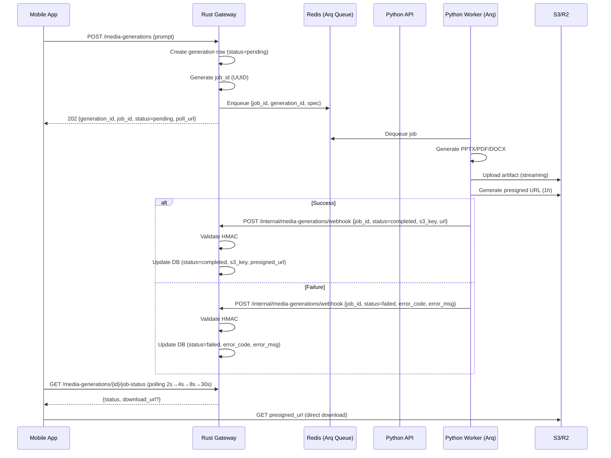

# Migration Plan: Sync → Async Media Generation with Object Storage

**Status**: 📋 Planned  
**Target**: Transform Python Media Generator from synchronous HTTP to async job queue with direct S3/R2 upload + Reliable Webhook Callback  
**Estimated Effort**: 8-12 days  

---

## 📝 Changelog / Architect Notes

> **Arsitektur Baru: Reliable Webhook Callback + Redis/Arq (Best of Both Worlds)**
> 
> **Perubahan Kritis dari Polling ke Webhook:**
> - **SEBELUM (Polling)**: Rust Worker mem-polling `GET /v1/jobs/{job_id}` ke Python API setiap beberapa detik → Beban tambahan di Python API, latency tidak deterministik, race condition potensial.
> - **SESUDAH (Webhook)**: Python Arq Worker mengirim `POST /internal/media-generations/webhook` ke Rust Gateway **sekali** saat selesai/gagal → Zero polling overhead, real-time notification, Rust Gateway menjadi *source of truth* status job.
> 
> **Keandalan Webhook (Crucial):**
> - Python Worker mengimplementasikan **Auto-Retry dengan Exponential Backoff** (max 5 attempts: 2s, 4s, 8s, 16s, 32s) untuk pengiriman webhook.
> - Jika Rust Gateway *down*, *restart*, atau *network blip* → Python Worker *retry* otomatis tanpa kehilangan job.
> - Jika semua retry gagal → Job ditandai `failed` di Redis dengan `error_code: WEBHOOK_DELIVERY_FAILED` → Masuk Dead Letter Queue (DLQ) untuk investigasi manual.
> - **HMAC Signature Validation** wajib di endpoint Rust untuk keamanan (mencegah spoofing callback).
> 
> **Pertahankan Keunggulan Plan 1:**
> - ✅ Redis + Arq sebagai job queue (bukan FastAPI BackgroundTasks)
> - ✅ Direct S3 Upload dari Python Worker
> - ✅ Mobile App polling ke Rust Gateway (bukan ke Python) dengan Exponential Backoff
> - ✅ Struktur Phase 1-5, Success Criteria, Dependencies, Rollback Plan

---

## Phase 1: Database & Rust API Foundation (Days 1-3)

### Task 1.1: Database Migration for Job Tracking
- [x] **Sub-task 1.1.1**: Create migration file `migrations/xxxx_add_generation_job_tracking.sql`
  - [x] Add `generation_job_id UUID` column
  - [x] Add `generation_status VARCHAR(20)` column with CHECK constraint (`pending`, `processing`, `completed`, `failed`)
  - [x] Add `s3_object_key VARCHAR(1024)` column
  - [x] Add `presigned_download_url TEXT` column
  - [x] Add `presigned_url_expires_at TIMESTAMPTZ` column
  - [x] Add `generation_error_code VARCHAR(100)` column
  - [x] Add `generation_error_message TEXT` column
  - [x] Add indexes on `generation_job_id` and `generation_status`
- [x] **Sub-task 1.1.2**: Run migration on local/dev database
- [x] **Sub-task 1.1.3**: Verify schema with `sqlx prepare --check`

### Task 1.2: Update MediaGeneration Repository
- [x] **Sub-task 1.2.1**: Add `update_generation_job_status()` method in `gateway/src/db/repositories/media_generations.rs`
- [x] **Sub-task 1.2.2**: Add `find_by_job_id()` method
- [x] **Sub-task 1.2.3**: Add `update_s3_metadata()` method (s3_object_key, presigned_url, expires_at)
- [x] **Sub-task 1.2.4**: Add `update_generation_error()` method

### Task 1.3: Rust API Endpoints (Public + Internal)
- [x] **Sub-task 1.3.1**: Modify `create()` in `gateway/src/api/rest/media_generations.rs`
  - [x] Generate `job_id` (UUID) after creation
  - [x] Update DB with `generation_job_id` and `generation_status='pending'`
  - [x] Enqueue to Redis with `job_id` in payload
  - [x] Return `202 Accepted` with `{generation_id, job_id, status: "pending", poll_url}`
- [x] **Sub-task 1.3.2**: Add `job_status()` endpoint `GET /media-generations/{id}/job-status`
  - [x] Fetch generation by ID (scoped to teacher)
  - [x] Return status, presigned URL if completed, error if failed
  - [x] Generate presigned URL on-demand if completed (1 hour expiry)
- [x] **Sub-task 1.3.3**: **NEW - Add Internal Webhook Receiver** `POST /internal/media-generations/webhook`
  - [x] **HMAC Signature Validation**: Verify `X-Webhook-Signature` header using shared secret `MEDIA_GEN_WEBHOOK_SECRET`
  - [x] Accept payload: `{job_id, generation_id, status, s3_object_key?, presigned_url?, expires_at?, error_code?, error_message?}`
  - [x] Idempotency: Use `job_id` as key, ignore duplicate callbacks
  - [x] Update DB: `generation_status`, `s3_object_key`, `presigned_download_url`, `presigned_url_expires_at`, error fields
  - [x] Return `200 OK` on success, `4xx` on validation error (triggers Python retry)
- [x] **Sub-task 1.3.4**: Add `JobStatusResponse` DTO with proper serialization
- [x] **Sub-task 1.3.5**: Add OpenAPI documentation for new endpoints (exclude internal webhook from public docs)

### Task 1.4: Rust Worker Integration (Fire-and-Forget)
- [x] **Sub-task 1.4.1**: Update `QueueService::enqueue()` to accept `job_id` parameter
- [x] **Sub-task 1.4.2**: Modify `worker.rs` to pass `job_id` to workflow
- [x] **Sub-task 1.4.3**: Update `WorkflowService::process()` signature to accept `job_id`
- [x] **Sub-task 1.4.4**: In `ensure_generated` step: call Python async endpoint `POST /v1/jobs` (fire-and-forget)
  - [x] Send `generation_id`, `job_id`, `generation_spec`
  - [x] On 202 Accepted: update DB `generation_status='processing'` and return **immediately**
  - [x] **HAPUS**: Polling logic (`Sub-task 1.4.5` dari plan lama)
  - [x] **HAPUS**: Fetch presigned URL & update DB on completion (Python handles via webhook)
  - [x] **HAPUS**: Update DB on failure (Python handles via webhook)
- [x] **Sub-task 1.4.5**: Worker only responsible for: LLM steps (interpret/draft) → Enqueue generation job → Mark `generation_status='processing'` → Done

---

## Phase 2: Python Service Async Transformation (Days 3-7)

### Task 2.1: New Async Endpoints (Python API)
- [x] **Sub-task 2.1.1**: Create `GenerateJobRequest` model in `app/models.py`
  - [x] Fields: `generation_id`, `job_id`, `generation_spec`, `webhook_url` (Rust internal endpoint)
- [x] **Sub-task 2.1.2**: Add `POST /v1/jobs` endpoint in `app/main.py`
  - [x] Validate HMAC signature (existing `verify_request_signature`)
  - [x] Extract `job_id` from request (provided by Rust)
  - [x] Store job metadata in Redis hash `gen:job:{job_id}`
  - [x] Push `job_id` to Redis list `gen:jobs:queue` (Arq queue)
  - [x] Return `202 Accepted` with `{job_id, generation_id, status: "pending"}`
- [x] **Sub-task 2.1.3**: Add `GET /v1/jobs/{job_id}` endpoint (for debugging/admin)
  - [x] Fetch job data from Redis
  - [x] Return status + artifact metadata + presigned URL if completed
  - [x] Return error details if failed
- [x] **Sub-task 2.1.4**: Add `JobStatusResponse` model
- [x] **Sub-task 2.1.5**: Deprecate `POST /v1/generate` (return 410 with migration guide)
- [x] **Sub-task 2.1.6**: Remove `GET /v1/artifacts/download` endpoint

### Task 2.2: Redis Job Storage
- [x] **Sub-task 2.2.1**: Add Redis client initialization in `app/main.py` lifespan
- [x] **Sub-task 2.2.2**: Create `app/job_store.py` module for Redis operations
  - [x] `create_job(job_id, generation_id, spec, webhook_url)`
  - [x] `get_job(job_id)`
  - [x] `update_job_status(job_id, status, **kwargs)`
  - [x] `set_job_result(job_id, artifact_metadata, presigned_url, s3_key)`
  - [x] `set_job_error(job_id, error_code, error_msg)`
- [x] **Sub-task 2.2.3**: Add Redis connection config to `app/settings.py`

### Task 2.3: Background Worker (Arq) + **Reliable Webhook Callback**
- [x] **Sub-task 2.3.1**: Add `arq` and `arq[redis]` to `requirements.txt`
- [x] **Sub-task 2.3.2**: Create `app/worker.py` with `GenerationWorker` class
  - [x] Connect to Redis
  - [x] Register job function `process_generation_job`
  - [x] Configure concurrency (from settings)
- [x] **Sub-task 2.3.3**: Implement `process_generation_job(ctx, job_id)` function
  - [x] Update status to `processing` in Redis
  - [x] Load generation spec + `webhook_url` from Redis
  - [x] Generate artifact via existing generator registry
  - [x] Upload to S3/R2 directly (streaming via `upload_fileobj`)
  - [x] Generate presigned URL (1 hour expiry)
  - [x] Store result in Redis with `completed` status
  - [x] **NEW: Send Webhook to Rust Gateway** (see Sub-task 2.3.7)
  - [x] Cleanup temp files
- [x] **Sub-task 2.3.4**: Add error handling with retry logic (max 3 retries for generation)
- [x] **Sub-task 2.3.5**: Add dead letter handling for exhausted generation retries
- [x] **Sub-task 2.3.6**: Create `app/worker_entrypoint.py` for running worker
- [x] **Sub-task 2.3.7**: **CRITICAL - Implement Reliable Webhook Sender** in `app/webhook_sender.py`
  - [x] Function `send_webhook_with_retry(webhook_url, payload, hmac_secret, max_attempts=5)`
  - [x] **Exponential Backoff**: 2s, 4s, 8s, 16s, 32s (total ~62s max)
  - [x] **HMAC Signing**: Generate `X-Webhook-Signature` = HMAC-SHA256(payload, secret)
  - [x] **Retry Conditions**: Network error, 5xx, 429, timeout
  - [x] **Non-Retry Conditions**: 4xx (except 429) → log error, stop retry
  - [x] **On All Retries Exhausted**: 
    - [x] Update Redis job status to `failed` with `error_code: WEBHOOK_DELIVERY_FAILED`
    - [x] Push to DLQ: `gen:jobs:dlq` with full payload + error history
    - [x] Emit alert/metric for manual intervention
- [x] **Sub-task 2.3.8**: Call `send_webhook_with_retry()` at end of `process_generation_job` (both success & failure paths)

### Task 2.4: S3/R2 Direct Upload
- [x] **Sub-task 2.4.1**: Add S3 client creation in `app/settings.py` or new `app/storage.py`
- [x] **Sub-task 2.4.2**: Modify `BaseGenerator.generate()` to return `artifact_locator.kind="storage_object"`
- [x] **Sub-task 2.4.3**: In worker: upload artifact bytes directly to S3 using `upload_fileobj` (streaming)
- [x] **Sub-task 2.4.4**: Generate object key: `materials/{generation_id}/{filename}`
- [x] **Sub-task 2.4.5**: Generate presigned URL with 1 hour expiry
- [x] **Sub-task 2.4.6**: Store `s3_object_key` and `presigned_url` in job result

### Task 2.5: Preview Generation (Async)
- [x] **Sub-task 2.5.1**: Move preview generation to background (optional, can be sync in worker)
- [x] **Sub-task 2.5.2**: Upload preview HTML to S3 with key `previews/{generation_id}/preview.html`
- [x] **Sub-task 2.5.3**: Generate presigned preview URL, include in artifact metadata

---

## Phase 3: Integration & Polish (Days 7-10)

### Task 3.1: End-to-End Testing
- [x] **Sub-task 3.1.1**: Start all services (Rust Gateway, Redis, Python API, Python Worker)
- [x] **Sub-task 3.1.2**: Test happy path: Mobile → Rust → Redis → Python Worker → S3 → **Webhook → Rust** → Mobile
- [x] **Sub-task 3.1.3**: Verify presigned URL download works from mobile
- [x] **Sub-task 3.1.4**: Test error scenarios:
  - [x] Python worker crash mid-generation
  - [x] S3 upload failure
  - [x] Invalid generation spec
  - [x] Presigned URL expiry
  - [x] **NEW: Rust Gateway down during webhook delivery** (verify Python retry kicks in)
  - [x] **NEW: Webhook signature validation failure** (verify 4xx stops retry)
  - [x] **NEW: All webhook retries exhausted** (verify DLQ entry created)
- [x] **Sub-task 3.1.5**: Test duplicate detection (request_fingerprint)
- [x] **Sub-task 3.1.6**: Test regeneration flow

### Task 3.2: Observability (Enhanced for Webhook)
- [x] **Sub-task 3.2.1**: Add structured logging for job lifecycle (created, processing, completed, failed)
- [x] **Sub-task 3.2.2**: Add metrics:
  - [x] Job duration (histogram)
  - [x] Queue depth (gauge)
  - [x] Success/failure rate (counter)
  - [x] **NEW: Webhook delivery attempts (counter: success/failures/success)**
  - [x] **NEW: Webhook delivery latency (histogram)**
  - [x] **NEW: DLQ depth (gauge)**
- [x] **Sub-task 3.2.3**: Add tracing spans for async workflow + webhook delivery
- [x] **Sub-task 3.2.4**: **NEW: Python Worker logs** `webhook.attempt`, `webhook.success`, `webhook.exhausted` with `job_id`, `attempt`, `latency_ms`

### Task 3.3: Documentation
- [x] **Sub-task 3.3.1**: Update `docs/architecture/TECH_STACK.md` with new async flow + webhook
- [x] **Sub-task 3.3.2**: Update `docs/contracts/internal-media-gen.md` with new API contracts
- [x] **Sub-task 3.3.3**: Create mobile integration guide in `docs/mobile/async_media_gen.md`
- [x] **Sub-task 3.3.4**: **NEW: Document webhook contract** (payload schema, HMAC algorithm, retry policy) in `docs/contracts/webhook_media_gen.md`

---

## Phase 4: Mobile App Integration (Days 10-12)

### Task 4.1: Mobile Polling Logic (Unchanged - Polls Rust Gateway)
- [x] **Sub-task 4.1.1**: Implement exponential backoff polling (2s, 4s, 8s, max 30s)
- [x] **Sub-task 4.1.2**: Handle `pending` → `processing` → `completed` states
- [x] **Sub-task 4.1.3**: Download directly from presigned S3 URL (bypass Rust Gateway)
- [x] **Sub-task 4.1.4**: Support resume download (HTTP Range requests)
- [x] **Sub-task 4.1.5**: Handle `failed` state with user-friendly error

### Task 4.2: UI/UX Improvements
- [x] **Sub-task 4.2.1**: Show progress indicator during polling
- [x] **Sub-task 4.2.2**: Add "Cancel" option (call DELETE on job if supported)
- [x] **Sub-task 4.2.3**: Offline support: queue generation requests when offline

---

## Phase 5: Cleanup & Deprecation (Day 12+)

### Task 5.1: Remove Legacy Code
- [x] **Sub-task 5.1.1**: Remove `PythonMediaGeneratorClient.generate()` sync method
- [x] **Sub-task 5.1.2**: Remove `artifact_download.py` (no longer needed)
- [x] **Sub-task 5.1.3**: Remove `GET /v1/artifacts/download` from Python
- [x] **Sub-task 5.1.4**: Remove temp file handling from generators
- [x] **Sub-task 5.1.5**: Remove `sidecar_manager` if only used for preview (or keep for preview)

### Task 5.2: Performance Tuning
- [x] **Sub-task 5.2.1**: Tune Python worker concurrency based on CPU/memory
- [x] **Sub-task 5.2.2**: Optimize S3 upload (multipart for large files > 50MB)
- [x] **Sub-task 5.2.3**: Add Redis connection pooling
- [x] **Sub-task 5.2.4**: **NEW: Tune webhook retry parameters** based on production latency profile

---

## Dependencies & Blockers

| Dependency | Status | Notes |
|------------|--------|-------|
| Redis Streams (existing) | ✅ Available | Used by Rust Gateway for LLM queue |
| Redis (for Python Arq) | ✅ Same instance | Separate DB index recommended |
| S3/R2 Credentials | ✅ Configured | In `AppConfig` |
| Python `arq` library | ⏳ Need to add | `pip install arq` |
| Rust `aws-sdk-s3` for presigned URL | ✅ Available | In `gateway/src/storage/r2.rs` |
| **NEW: Shared HMAC Secret for Webhook** | ⏳ Need to generate | `MEDIA_GEN_WEBHOOK_SECRET` in both .env |
| **NEW: Internal Network Connectivity** | ⏳ Verify | Python Worker → Rust Gateway (`/internal/...`) |

---

## Success Criteria

- [ ] **Zero HTTP timeouts** on generation requests (mobile gets 202 instantly)
- [ ] **No memory bloat** in Rust Gateway (no downloading artifact bytes)
- [ ] **Direct S3 download** from mobile (presigned URL, bypass Gateway)
- [ ] **Reliable delivery** via Webhook + Auto-Retry (no lost completions even if Rust restarts)
- [ ] **Observability**: Job status visible in DB + Redis + Webhook metrics
- [ ] **Backward compatibility**: Existing generations still accessible
- [ ] **Zero polling overhead** on Python API (Rust never polls Python)

---

## Rollback Plan

If critical issues arise:
1. Re-enable `POST /v1/generate` sync endpoint in Python
2. Revert Rust Gateway to call sync endpoint (with polling fallback in worker)
3. Keep DB schema changes (additive only)
4. Mobile falls back to polling old endpoint (still works)
5. **Webhook endpoint can remain** (harmless if unused)

---

## Architecture Diagram (Reference)

---

*Generated: 2026-07-16*  
*Architect: Senior Backend Architect & AI Systems Engineer*  
*Revision: v2 - Reliable Webhook Callback Architecture*