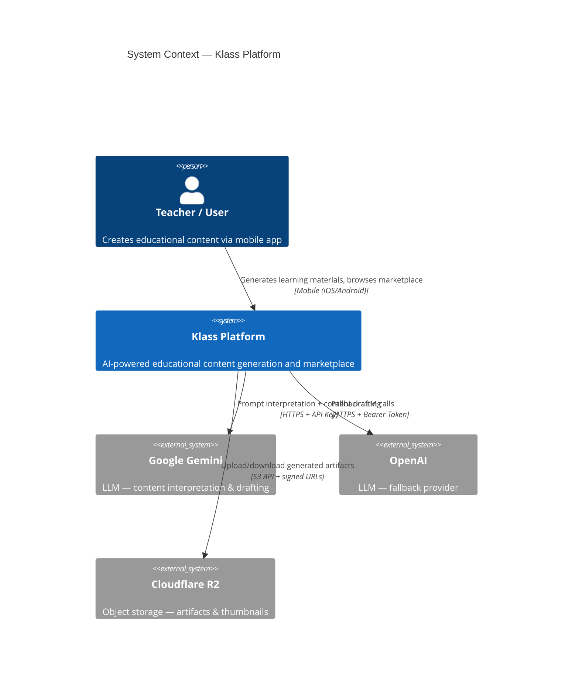
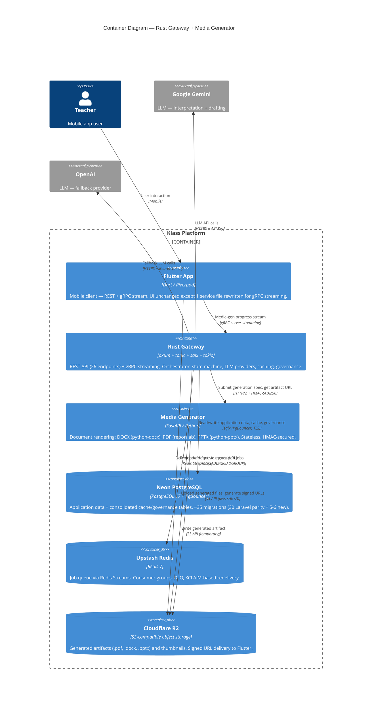
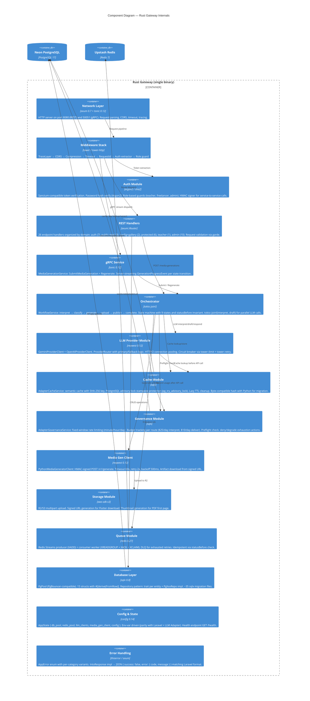
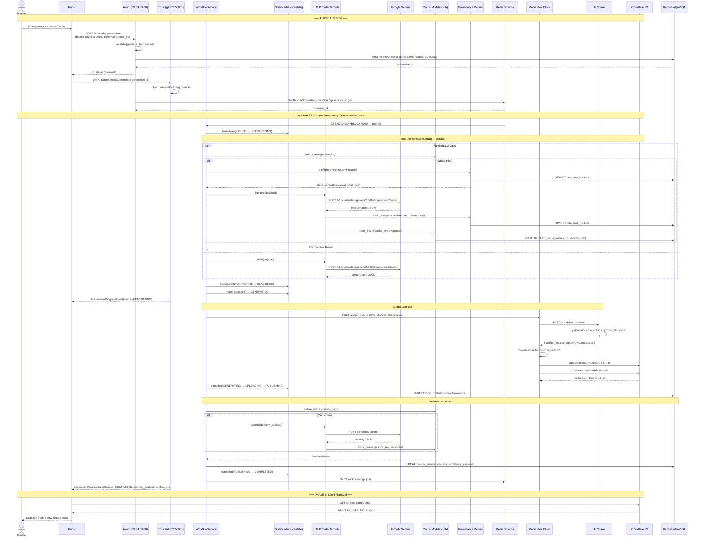
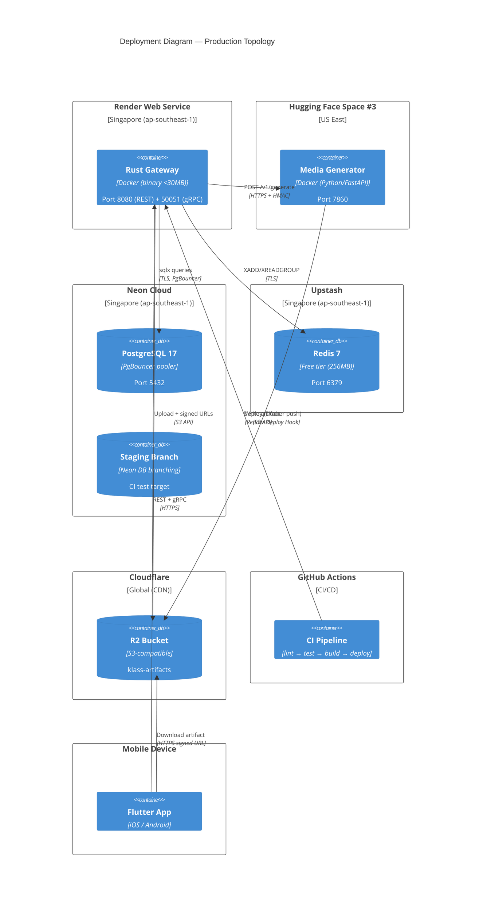

# Target Architecture: Klass Rust Gateway

> **Phase**: Fase 2 Design (Task 2.2)
> **Status**: Accepted
> **Date**: 2026-07-11
> **Based on**: ADR-001 through ADR-008, `INTEGRATION_MAPPING.md`

---

## Table of Contents

1. [System Context (C4 Level 1)](#system-context-c4-level-1)
2. [Container Diagram (C4 Level 2)](#container-diagram-c4-level-2)
3. [Rust Gateway Internal Components (C4 Level 3)](#rust-gateway-internal-components-c4-level-3)
4. [Data Flow: Media Generation](#data-flow-media-generation)
5. [Communication Protocol Matrix](#communication-protocol-matrix)
6. [Deployment View](#deployment-view)
7. [Concurrency & Connection Model](#concurrency--connection-model)

---

## System Context (C4 Level 1)



The Klass Platform is a single logical system from the user's perspective. Internally, it is composed of two runtime containers: the **Rust Gateway** (API + orchestrator + LLM integration) and the **Media Generator** (document rendering). These are detailed in the Container Diagram below.

---

## Container Diagram (C4 Level 2)



### Container Responsibilities

| Container | Stack | Responsibilities | Scale |
|-----------|-------|-----------------|-------|
| **Flutter App** | Dart 3.11, Riverpod, Dio | 26 REST screens + gRPC progress listener. Auth, home, search, gallery, profile, freelancer marketplace. | N/A (client-side) |
| **Rust Gateway** | Rust (axum 0.7, tonic 0.12, sqlx 0.8, tokio 1.x) | All API endpoints, Sanctum auth, media-gen orchestrator (9-state), LLM provider routing, semantic cache, rate-limit governance, Redis Streams producer/consumer. | Render Starter: 0.5 vCPU, 512MB RAM |
| **Media Generator** | Python (FastAPI, python-docx, reportlab, python-pptx) | Stateless renderer: receives generation spec → produces .docx/.pdf/.pptx → returns signed URL. | HF Space #3 (shared CPU, auto-sleep) |
| **Neon PostgreSQL** | PostgreSQL 17 + PgBouncer | Application data (users, topics, media_generations, etc.) + consolidated LLM cache + governance tables. | Free tier: 10 connections (PgBouncer) |
| **Upstash Redis** | Redis 7 | Job queue: `KLASS:media-generation` stream + `KLASS:media-generation-dlq`. Consumer group: `KLASS:workers`. | Free tier: 256MB, 10k cmd/day |
| **Cloudflare R2** | S3-compatible | Generated file storage + thumbnail storage. Signed URL delivery. | Pay-per-request (~$0-5/mo) |

---

## Rust Gateway Internal Components (C4 Level 3)



### Module Dependency Map

```
network (axum + tonic)
  ├── middleware stack
  │     ├── TraceLayer
  │     ├── CORS
  │     ├── CompressionLayer
  │     ├── TimeoutLayer (30s default)
  │     ├── RequestId middleware
  │     ├── Auth extractor → Sanctum token verify → role guard
  │     └── StructuredApiLogger
  │
  ├── REST handlers (26 endpoints)
  │     ├── AuthController        (register, login, logout, me, refresh, security-question, verify-reset)
  │     ├── TopicController       (index, show, store, update, destroy)
  │     ├── ContentController     (index, show, store, update, destroy)
  │     ├── MarketplaceController (index, show, store, update, destroy)
  │     ├── ProgressController    (index, show, store, update, destroy)
  │     ├── MediaGenController    (index, store, show, regenerate)
  │     ├── HomeController        (recommendations, sections)
  │     ├── GalleryController     (index)
  │     ├── UserController        (avatar)
  │     ├── FreelancerController  (suggest, hire)
  │     ├── UploadController      (upload, destroy)
  │     └── DebugController       (taxonomy)
  │
  └── gRPC service (1 endpoint)
        └── MediaGenerationService
              ├── SubmitMediaGeneration (server-streaming)
              └── Regenerate (server-streaming)

orchestrator (WorkflowService)
  ├── StateMachine (MediaGenerationLifecycle — 9 states)
  ├── tokio::join!(interpret, draft)  ← parallel LLM calls
  │
  ├── interpret → LLM Provider Module (router)
  │     ├── Primary: GeminiProviderClient → https://generativelanguage.googleapis.com
  │     ├── Fallback: OpenAIProviderClient → https://api.openai.com
  │     ├── Circuit breaker: tower::limit + tower::retry
  │     └── Cache integration: lookup before call, store after
  │
  ├── classify → Local decision (no external call)
  │
  ├── generate → Media Gen Client
  │     └── POST /v1/generate (HMAC-SHA256) → download artifact → upload to R2
  │
  ├── publish → Create Topic + Content + MediaFile records
  │
  └── respond → LLM Provider Module (drafting) → delivery payload composition

infrastructure cross-cutting
  ├── db layer (sqlx::PgPool → Neon via PgBouncer)
  ├── cache module (semantic cache, advisory lock stampede protection)
  ├── governance module (rate limits, budget tracking, preflight)
  ├── queue module (Redis Streams: producer + consumer worker)
  ├── storage module (aws-sdk-s3 → Cloudflare R2)
  └── config (AppState, env vars, health endpoint)
```

---

## Data Flow: Media Generation

The following data flow applies identically for **PDF**, **DOCX**, and **PPTX** output formats. The only difference is the `preferred_output_type` field in the request and the `export_format` returned by the Media Generator.

### Sequence: Submit → Completed (Full Lifecycle)



### State Transitions Per Integration Call

```
QUEUED ──(worker picks up job)────────────────► INTERPRETING
                                                    │
                     POST /v1/interpret (LLM Adapter)│
                     POST /v1/draft (LLM Adapter)    │ tokio::join!
                                                    ▼
                                               CLASSIFIED
                                                    │
                     Local decision (no external)   │
                                                    ▼
                                               GENERATING
                                                    │
                     POST /v1/generate (Media Gen)   │
                                                    ▼
                                               UPLOADING
                                                    │
                     S3 multipart upload to R2       │
                                                    ▼
                                               PUBLISHING
                                                    │
                     POST /v1/respond (LLM Adapter)  │
                                                    ▼
                                               COMPLETED

Any state ──(fatal error)──► FAILED
Any state ──(user cancel)──► CANCELLED
```

### Output Format Differences

| Phase | PDF | DOCX | PPTX |
|-------|-----|------|------|
| Request | `preferred_output_type: "pdf"` | `preferred_output_type: "docx"` | `preferred_output_type: "pptx"` |
| Media Gen library | `reportlab` | `python-docx` | `python-pptx` |
| MIME type | `application/pdf` | `application/vnd.openxmlformats-officedocument.wordprocessingml.document` | `application/vnd.openxmlformats-officedocument.presentationml.presentation` |
| Thumbnail | PDF first-page render | (icon) | (icon) |
| **All other steps identical** | ✅ | ✅ | ✅ |

---

## Communication Protocol Matrix

```
                    Flutter                   Rust Gateway             Media Gen           Gemini/OpenAI          R2
                    ───────                   ────────────             ─────────           ─────────────          ──
Flutter             ·                         REST/JSON (Dio)          ·                    ·                      S3 signed URL (HTTPS)
                                             + gRPC stream (tonic)

Rust Gateway        REST/JSON (axum :8080)    ·                        HTTP/2 + HMAC         HTTPS + API Key        S3 API (aws-sdk-s3)
                    gRPC stream (tonic :50051)                          POST /v1/generate     POST generateContent
                                                                       (60s timeout)         (30s timeout)

Media Gen           ·                         HTTP/2 + HMAC            ·                    ·                      S3 write (temporary)
                                               POST /v1/generate

Redis (Upstash)     ·                         Redis Streams            ·                    ·                      ·
                                               XADD / XREADGROUP
                                               XACK / XCLAIM

Neon PostgreSQL     ·                         sqlx (PgBouncer, TLS)    ·                    ·                      ·
```

### Detailed Protocol Per Edge

| # | From | To | Protocol | Auth | Port | TLS | Details |
|---|------|----|----------|------|------|-----|---------|
| 1 | Flutter | Rust Gateway | REST/JSON | Bearer (Sanctum token) | 8080 | Yes | Dio HTTP client. 26 endpoints. Error format: `{success, error: {code, message}}`. Read timeout: 30s. |
| 2 | Flutter | Rust Gateway | gRPC server-streaming | Bearer (metadata) | 50051 | Yes | Tonic + grpc (Dart). Single RPC with stream of `GenerationProgressEvent`. Fallback to REST polling if gRPC blocked. |
| 3 | Flutter | R2 | HTTPS GET | Signed URL (query param) | 443 | Yes | Download generated artifact. URL from `delivery_payload.artifact.url`. Time-limited (expiry configurable). |
| 4 | Rust Gateway | Media Generator | HTTP/2 + JSON | HMAC-SHA256 | 443 | Yes | POST `/v1/generate`. Headers: `X-Klass-Generation-Id`, `X-Klass-Request-Timestamp`, `X-Klass-Signature-Algorithm`, `X-Klass-Signature`. Timeout: 60s. Retry: 2x, backoff 500ms. |
| 5 | Rust Gateway | Gemini | HTTPS + JSON | API Key (query param) | 443 | Yes | POST `/v1beta/models/{model}:generateContent`. Default model: `gemini-2.0-flash`. Timeout: 30s. |
| 6 | Rust Gateway | OpenAI | HTTPS + JSON | Bearer Token | 443 | Yes | POST `/v1/responses`. Optional: `OpenAI-Organization`, `OpenAI-Project` headers. Default model: `gpt-5.4`. Timeout: 30s. |
| 7 | Rust Gateway | Neon PostgreSQL | PostgreSQL wire | Password | 5432 | Yes | Via PgBouncer (connection pooling). Max 5 connections from Gateway. sqlx async queries. |
| 8 | Rust Gateway | Upstash Redis | Redis protocol | Password | 6379 | Yes | Redis Streams commands: XADD, XREADGROUP, XACK, XCLAIM. Connection pool: deadpool-redis. |
| 9 | Rust Gateway | R2 | S3 API | Access Key + Secret | 443 | Yes | aws-sdk-s3. Multipart upload for artifacts. Generate signed URLs (GET). |
| 10 | Media Generator | R2 | S3 API | Access Key + Secret | 443 | Yes | Write generated artifact (temporary). URL returned to Gateway for re-upload to permanent location. |

---

## Deployment View



### Network Latency Budget

| Hop | Distance | Latency (p50) | Latency (p99) |
|-----|----------|---------------|---------------|
| Flutter → Render (Singapore) | Variable (mobile) | 50-200ms | 500ms |
| Render → Neon (same region) | <1ms (same DC) | <1ms | <5ms |
| Render → Upstash (same region) | <1ms (same DC) | <1ms | <5ms |
| Render → Media Gen (US East → Singapore) | ~12,000 km | 180ms | 250ms |
| Render → Gemini API (Google) | Variable | 80ms | 200ms |
| Render → OpenAI API | Variable | 150ms | 400ms |
| Render → R2 (CDN) | Variable (nearest PoP) | 20ms | 80ms |

> **Note**: Media Gen berada di US East (HF Space default region). Latency 180ms ini adalah bottleneck terbesar. Jika tersedia HF Space region Singapore, ini bisa turun ke <10ms. Fallback: HTTP/1.1 + keep-alive untuk mengurangi connection setup overhead.

---

## Concurrency & Connection Model

### Connection Pools

```
Rust Gateway (single binary)
│
├── Neon PostgreSQL (sqlx::PgPool)
│   ├── max_connections: 5  (Neon free tier: 10, sisakan 5 untuk dev tools)
│   ├── idle_timeout: 300s  (PgBouncer-compatible)
│   └── acquire_timeout: 10s
│
├── Upstash Redis (deadpool-redis)
│   ├── max_connections: 5  (Upstash free tier: 100)
│   ├── idle_timeout: 300s
│   └── wait_timeout: 5s
│
├── reqwest Client (LLM Provider HTTP/2)
│   ├── pool_max_idle_per_host: 20
│   ├── pool_idle_timeout: 90s
│   ├── http2_prior_knowledge: true
│   └── timeout: 30s
│
└── reqwest Client (Media Gen HTTP/2)
    ├── pool_max_idle_per_host: 5
    ├── http2_prior_knowledge: true
    └── timeout: 60s
```

### tokio Runtime Configuration

```rust
#[tokio::main]
async fn main() {
    // Multi-thread runtime (default: num_cpus threads)
    // Worker threads handle:
    //   - axum request handlers (REST)
    //   - tonic request handlers (gRPC)
    //   - Redis Stream consumer (spawned task)
    //   - Background cleanup tasks
    //
    // I/O intensive workload (not CPU-bound) → default thread count optimal
}
```

### Concurrency Limits

| Resource | Limit | Rationale |
|----------|-------|-----------|
| Concurrent media-gen jobs | 5 | Redis consumer group with 5 workers |
| Concurrent LLM provider calls | 20 | reqwest pool idle per host |
| DB connections | 5 | Neon free tier limit |
| Redis connections | 5 | Upstash free tier limit |
| Max request body | 10 MB | File upload handler |
| gRPC stream timeout | 300s | Queue job timeout |
| REST request timeout | 30s | Default handler timeout |

### Scaling Model

Gateway adalah **single binary, single instance** pada Starter tier. Arsitektur ini mendukung vertical scaling (upgrade Render tier) sebelum perlu horizontal scaling:

| Tier | vCPU | RAM | Concurrent Media-Gen | Monthly Cost |
|------|------|-----|----------------------|-------------|
| Starter | 0.5 shared | 512 MB | 1-5 jobs | $7 |
| Standard 1 | 1 dedicated | 2 GB | 5-20 jobs | $25 |
| Standard 2 | 2 dedicated | 4 GB | 20-50 jobs | $50 |

Jika horizontal scaling diperlukan (jarang — Rust binary efisien), Redis Streams consumer groups secara native mendukung multiple consumer instances tanpa perubahan kode.

---

## References

- `IMPLEMENTATION_PLAN.md` — Architecture Target (ASCII diagram), Risk Assessment Matrix
- `INTEGRATION_MAPPING.md` — Current state integration contracts, HMAC details, provider behavior, error codes
- `docs/adr/0001-rust-gateway-language.md` through `docs/adr/0008-cache-db-consolidation.md` — Architecture decisions
- `frontend/lib/core/network/dio_provider.dart` — Current Flutter HTTP client configuration
- `backend/config/services.php` — Current timeout/retry configuration
